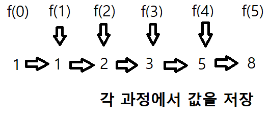
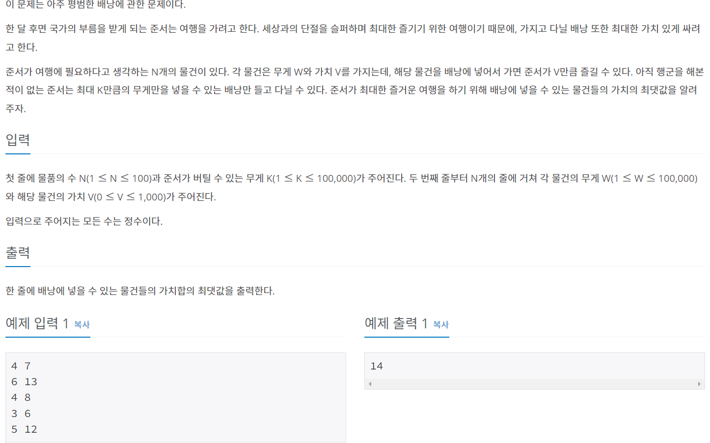
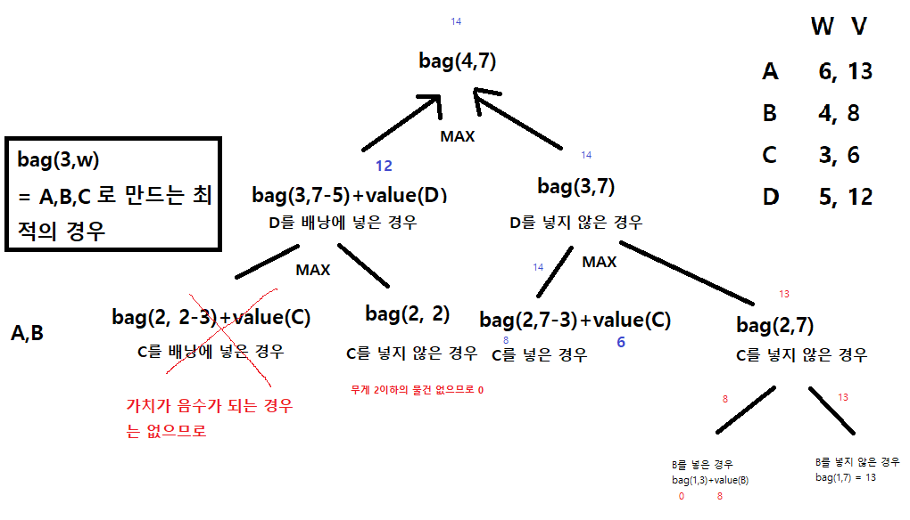
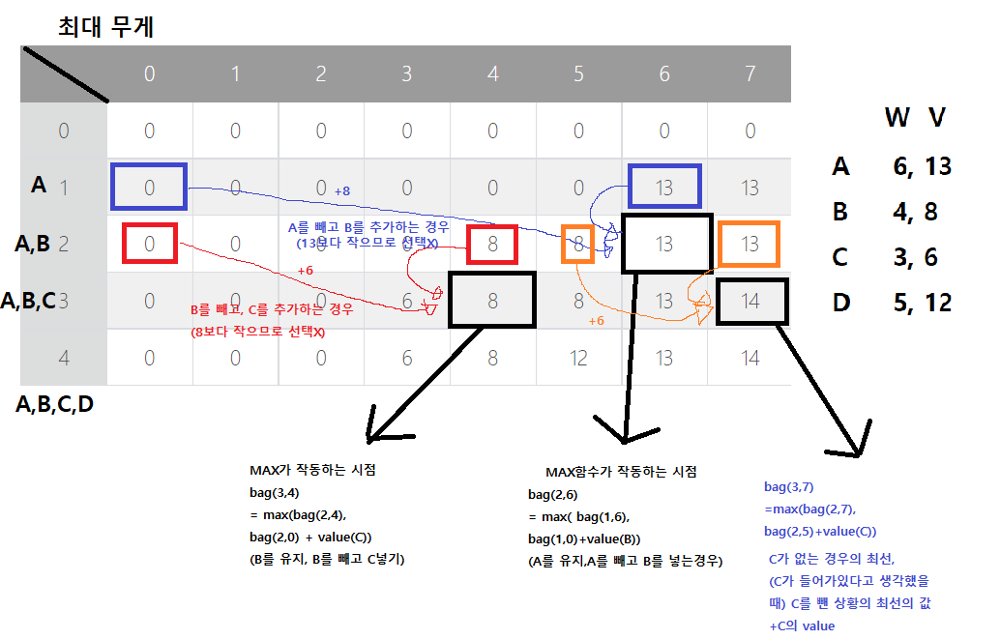

# Dynamic Programming

>  "하나의 문제를 한 번만 풀도록 하는 알고리즘"
>
>  : **메모이제이션을 통해 이전의 값을 재활용 (분할정복과의 차이=> 분할정복(병합,퀵정렬)은 부분문제가 중복되지 않으므로 메모이제이션이 필요없음)**
>
>  - Memoization (메모이제이션) : 프로그램 실행 시 이전에 계산한 값을 저장하여, 다시 계산하지 않도록 하여 전체 실행 속도를 빠르게 하는 기술

### 가정

1. 큰 문제를 작은 문제로 나눌 수 있다.
2. **작은 문제에서 구한 정답은 그것을 포함하는 큰 문제에서도 동일하다**


#### → 위 피보나치 방법은 O(n^2) 만큼의 시간복잡도를 가짐.



#### → 메모이제이션을 이용하면 O(n)의 시간복잡도


★★★★★★★★

### 배낭문제(b12865)



### 작은 문제로 쪼개기

 max(물건 하나를 담았을 경우 , 담지 않았을 경우) 로 쪼갬.

#### bag(N,K) : N개의 물건을 무게 K이하로 담을 수 있는 최고의 가치






#### brute-force 방식으로 문제를 풀 경우, O(2^n) 만큼의 시간복잡도를 가지지만, DP를 사용하면 O(KN)의 시간복잡도를 가진다.

```python
import sys

N, K = map(int, input().split())
stuff = [[0,0]]
knapsack = [[0 for _ in range(K + 1)] for _ in range(N + 1)]

for _ in range(N):
    stuff.append(list(map(int, input().split())))


#냅색 문제 풀이
for i in range(1, N + 1):
    for j in range(1, K + 1):
        weight = stuff[i][0] 
        value = stuff[i][1]
       
        if j < weight:
            knapsack[i][j] = knapsack[i - 1][j] #weight보다 작으면 위의 값을 그대로 가져온다
        else:
            knapsack[i][j] = max(value + knapsack[i - 1][j - weight], knapsack[i - 1][j])

print(knapsack[N][K])
```


### 참고 :

https://m.blog.naver.com/kks227/220777103650

https://claude-u.tistory.com/208