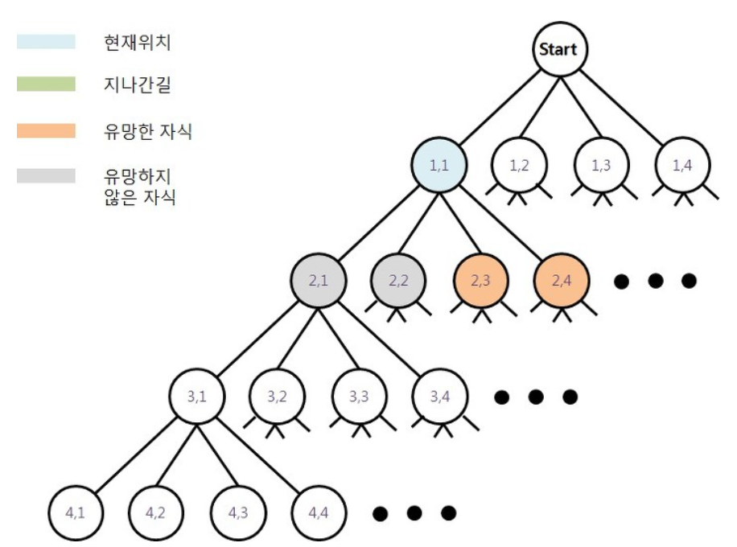

# 백트래킹(Backtracking)

> 기본적으로 '가능한 모든 방법을 탐색한다' (완전 탐색 방법)
>
> 그러나 DFS는 굳이 목표지점이 있지 않는 경로로 빠져 비효율적인 결과를 초래할 수 있다.

## 구현 과정

1. DFS 수행 - 평소와 같이 깊이우선탐색 수행

2. 유망한 노드 검토 - 유망한 노드이면 서브 트리로 이동하고, 그렇지 않으면 백트래킹을 수행

3. 

   - 유망한 경우 - 방문한 노드의 하위 노드로 이동하여 다시 재귀를 통해 DFS를 수행

   - 유망하지 않은 경우 - 백트래킹 수행 - 방문한 노드를 가지치기(끊어냄)하고 상위 노드로 돌아가 DFS를 다시 수행

### 예시(N-Queen)

크기가 N * N 인 체스판 위에 퀸 N 개를 서로 공격할 수 없게 놓는 문제

- 그림 이상함. (2,1) (2,2) 노드 cut
- DFS 였다면 위 그림처럼 4,1 4,2 4,3 4,4 노드까지 불필요한 노트 탐색
- backtracking으로 2,1 2,2 노드는 방문하지 않을 수 있음

### 참조

https://thd0011.tistory.com/19

