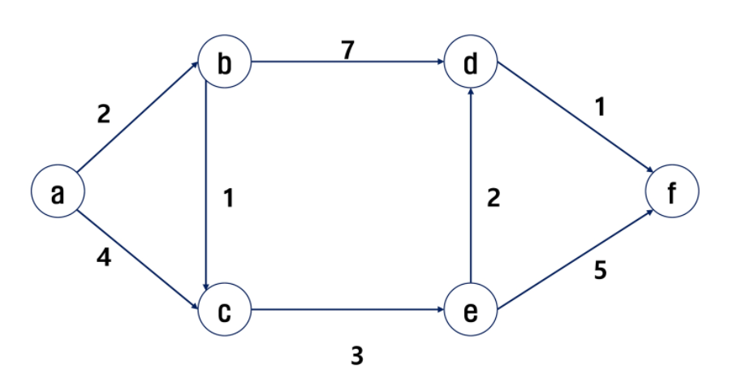

# Dijkstra

### 다익스트라(Dijkstra) 알고리즘

특정한 하나의 정점에서 다른 모든 정점으로 가는 최단 경로를 구하는 알고리즘

prim알고리즘과 유사


### 구현 과정

1. 출발 노드 설정
2. 출발 노드를 기준으로 각 노드의 최소비용 저장
3. 방문하지 않은 노드 중에서 가장 비용이 적은 노드를 선택
4. 해당 노드를 거쳐 특정 노드로 가는 경우를 고려하여 최소 비용 갱신
5. 3,4번 과정 반복



| MST [T,F,F,F,F,F] | a    | b     | c     | d     | e     | f     |
| ----------------- | ---- | ----- | ----- | ----- | ----- | ----- |
| **b추가**         | 0    | **2** | 4     | ∞     | ∞     | ∞     |
| **c추가**         | 0    | 2     | **3** | 9     | ∞     | ∞     |
| **e추가**         | 0    | 2     | 3     | 9     | **6** | ∞     |
| **d추가**         | 0    | 2     | 3     | **8** | 6     | 11    |
| **f추가**         | 0    | 2     | 3     | 8     | 6     | **9** |

```python
def dijkstra():
    start = 0
    visit = [False]*(N+1)
    MST[start] = 0
    for i in range(N+1):
        min_V = INF
        min_idx = -1
        for j in range(N+1):
            if not visit[j] and min_V>MST[j]:
                min_V = MST[j]
                min_idx = j
        visit[min_idx] = True
        for j in range(N+1):
            if not visit[j] and MST[j]>cost[min_idx][j]+min_V:
                MST[j] = cost[min_idx][j]+min_V
```


### 참고

https://m.blog.naver.com/ndb796/221234424646