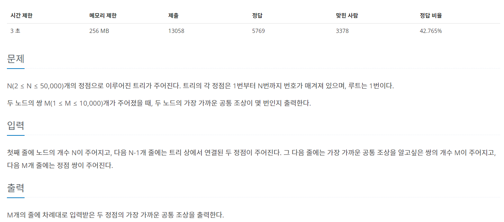
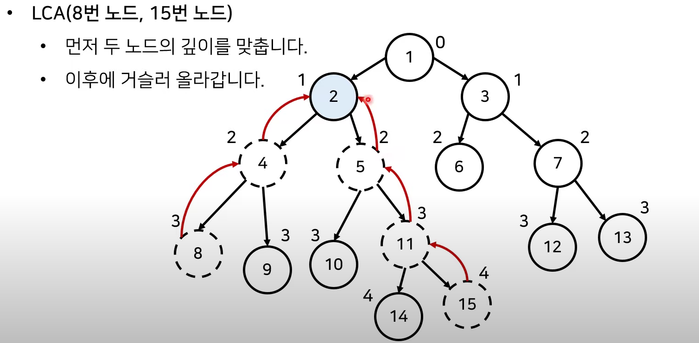
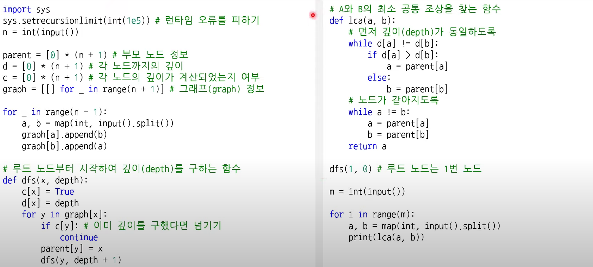

# LCA (최소 공통 조상Lowest Common Ancestor)

https://www.acmicpc.net/problem/11437



### 과정

1. 모든 노드의 깊이를 계산
2. 최소 공통 조상을 찾을 두 노드를 확인
   1. 먼저 두 노드의 깊이가 동일하도록 거슬러 올라감.
   2. 이후에 부모가 같아질 때까지 반복적으로 거슬러 올라감.




### 활용

: 선형 구조에서 두 노드의 가장 가까운 거리를 구할 때 활용


### 구현 코드



```java
public class Main {

	static ArrayList<Integer>[] tree;
	static int[] depths;
	static int[] parents;
	
	public static void main(String[] args) throws NumberFormatException, IOException {

		BufferedReader br = new BufferedReader(new InputStreamReader(System.in));
		int N = Integer.parseInt(br.readLine());
		tree = new ArrayList[N+1];
		depths = new int[N+1];
		parents = new int[N+1];
		Arrays.fill(depths, -1);
		for(int i=0; i<N+1;i++) {
			tree[i] = new ArrayList<Integer>();
		}
		
        // 연결 그래프 만들어주기
		for(int i = 0 ; i<N-1; i++) {			
			StringTokenizer st = new StringTokenizer(br.readLine());
			int parent = Integer.parseInt(st.nextToken());
			int child = Integer.parseInt(st.nextToken());
			tree[parent].add(child);
			tree[child].add(parent);
		}
		DFS(1,0,0);


		int M = Integer.parseInt(br.readLine());
		for(int i=0;i<M;i++) {
			StringTokenizer st = new StringTokenizer(br.readLine());
			int x = Integer.parseInt(st.nextToken());
			int y = Integer.parseInt(st.nextToken());
			System.out.println(LCS(x,y));
		}
		
		
	}
	
    // 깊이와 부모 배열 만들기
	static void DFS(int now, int parent, int depth) {
		depths[now] = depth;
		parents[now] = parent;
		for(int child:tree[now]) {
			if(child != parent) {
				DFS(child,now,depth+1);
			}
		}
	}
	
    // LCS 구하기
	static int LCS(int x,int y) {
        // 깊이가 같을 때까지 한 노드가 올라옴
		while(depths[x]!=depths[y]) {
			if(depths[x]>depths[y]) x = parents[x];
			else y = parents[y];
		}
        // 깊이가 같아 지면 같이 부모가 같아질 때까지 올라옴.
		while(x!=y) {
			x = parents[x];
			y = parents[y];
		}
		
		return x;
	}
}

```


### 참고

https://www.youtube.com/watch?v=O895NbxirM8