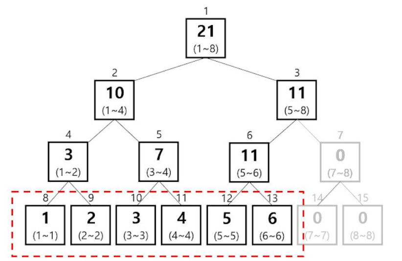
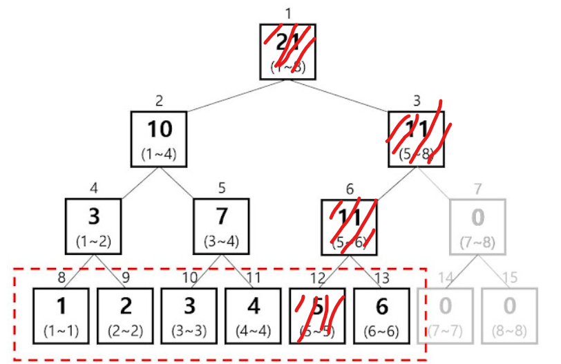

# 세그먼트 트리

### 개요

> 배열처럼 데이터가 일렬로 나열되어 있을 때, 특정 구간 합, 또는 특정 구간에서 가장 큰 수 등 구간의 정보를 효율적으로 얻어내기 위해 설계된 자료구조.

### 기본 구조

- 완전 이진 트리(Binary Tree)
- 배열의 각 요소들이 최하단의 리프노드.
- 자식 노드의 합이 부모 노드의 합.



### 사용 목적?

> [1,2,3,4,5,6] 이라는 배열 arr에서
>
> arr[3]+arr[4]+arr[5]를 3+4+5로 간단히 해결할 수 있지만,
>
> 여기에서 arr[3] = 20, arr[4] = -1이라는 값으로 바뀌면?
>
> 수를 바꾼 횟수 M, 배열의 크기 N이라고 할 때,
>
> M개의 수를 바꾸는데에 O(M), 수를 더하는데 O(MN)으로 O(M+MN)= O(MN)의 시간복잡도가 나온다
>
> 
>
> **이 때, 세그먼트 트리를 이용하면**
>
> 수를 바꾸는 과정 = O(M log N) 
>
> 수를 더하는 과정 = O(M log N)으로 변하게 된다.


### 구현 코드

- main (무시해도 됨)

```
package Algorithm_test;

public class segmentTree {

	static int Capacity=1;
	static int[] tree;
	
	public static void main(String[] args) {
		int[] data = {1,2,3,4,5,6,7};
		BuildTree(data.length,data);
		
		System.out.println(Query(4,5)); // 인덱스 4~5 구간합 구하기
	}
}

```

- 세그먼트 트리 만들기


```
	// 세그먼트 트리 만들기
	static void BuildTree(int N, int[] data) {
		int cnt=0;
		for(int capacity = 1; capacity<N; capacity *= 2) {Capacity=capacity*2;}; // 배열 크기 구하기 위한 Capacity 정함- N보다 큰 가장 작은 2의 제곱수
		tree = new int[Capacity*2]; // 트리의 크기는 Capacity의 2배로 하면 다 들어옴(귀찮으면 그냥 N*4하기도 함)
		for(int i=Capacity;i<Capacity+N;i++) {tree[i]=data[cnt++];} // 리프노드에 숫자 넣어주기		
		for(int i=Capacity-1; i>0;i--) {tree[i]=tree[2*i]+tree[2*i+1];} // 자식 노드의 합으로 부모노드 값 정해줌
	}
```

- 데이터 삽입, 수정, 삭제
  - 연관된 노드들의 값들을 갱신



```
	// 데이터 삽입, 수정, 삭제 -> 시간 복잡도 log N
	static void Update(int i, int data) {
		int k = Capacity + i;
		tree[k] = data;
		for(int j=k/2;j>0;j /= 2) {tree[j]=tree[j*2]+tree[j*2+1];}
	}
```

- 구간 합 구하기
  - L과 R 을 받아서 일단 리프노드로 간다.
  - L은 홀수가 될 때, 부모 기준 오른쪽에 존재하므로 stop (왼쪽 값은 구간에 들어있지 않다는 것)
  - R은 짝수가 될 때, 부모 기준 왼쪽에 존재하므로 stop (오른쪽 값은 구간에 들어있지 않다는 것)
  - ex) Query(2,5)
    L = 9, R = 12
    L이 홀수(9)이므로 위로 올라갈 필요가 없다(좌측값의 합을 필요로 하지 않으므로) 
    ret += 2(=tree[L]),    L -> 10 
    R이 짝수(12)이므로 위로 올라갈 필요가 없다(우측값의 합을 필요로 하지 않으므로)
    ret += 5(=tree[R]),    R -> 11
    L -> 5, R -> 5 반복문 종료.
    같은 값에 있는 경우 ret += tree[5]
    ret = 14

```
	// 부분합 추출
	static int Query(int L, int R) {
		int ret = 0;
		L += Capacity; //리프노드로 감
		R += Capacity; //리프노드로 감
		
		for(;L<R;L/=2, R/=2) { // L과 R을 부모 노드로 이동시킴
			if(L%2==1) ret+=tree[L++]; // 홀수라는 것은 우측에 있다는 것. 현재 L보다 좌측 값은 사용하지 않는다.
			if(R%2==0) ret+=tree[R--]; // 짝수라는 것은 좌측에 있다는 것. 현재 R보다 우측 값은 사용하지 않는다.
		}
		if(L==R) ret+= tree[L]; // 마지막에 같아져 더해주지 않은 값이 있으면 더해줌  
		return ret;
	}
```


### 참조

http://arkainoh.blogspot.com/2018/06/segment.tree.html