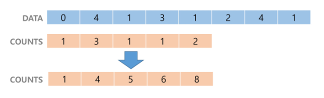
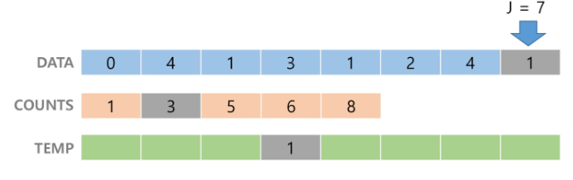
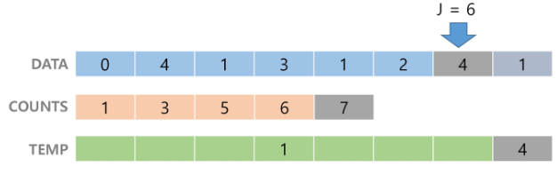
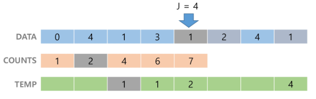
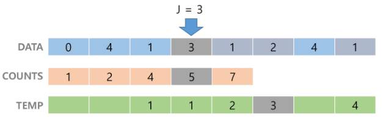
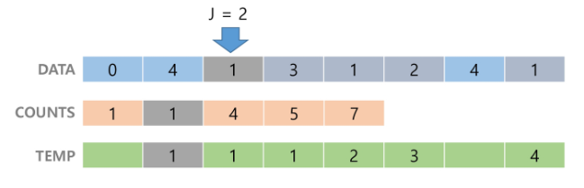
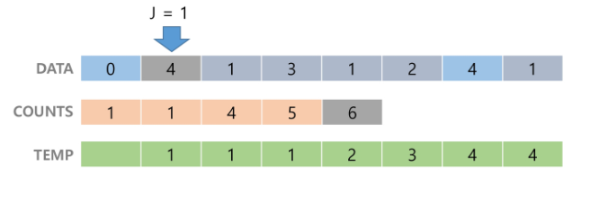
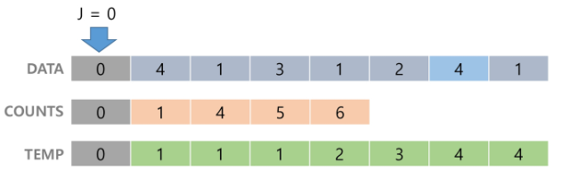

# Counting sort

### 정렬 방식

1. 숫자의 빈도를 저장하기 위한 배열 생성
2. 각 숫자에 해당하는 인덱스에 빈도수 저장(리스트의 모든 원소가 양의 정수일때만 가능.)
3.  배열을 탐색하며 빈도수에 따른 인덱스 부여




counts 배열을 1씩 감소시키면서, 그 인덱스에 값을 삽입.















### 시간 복잡도 : O(n+k)

### 구현 코드

```python
def counting_sort(A):
    counting = [0]*100    # 빈도수를 저장할 배열
    answer = [0]*len(A)   # 정렬된 배열
    for i in range(len(A)):               #
        counting[A[i]] += 1               #
    for i in range(1,len(counting)):      #
        counting[i] += counting[i-1]      # 빈도수 배열 완성
    for i in range(len(A)):
        answer[counting[A[i]]-1] = A[i]   # 하나씩 삽입하며 
        counting[A[i]] -= 1               # 값 1씩 감소시킴
    return answer
```

