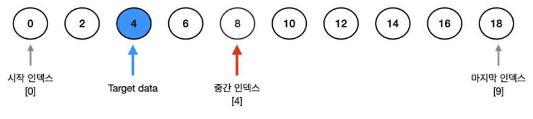
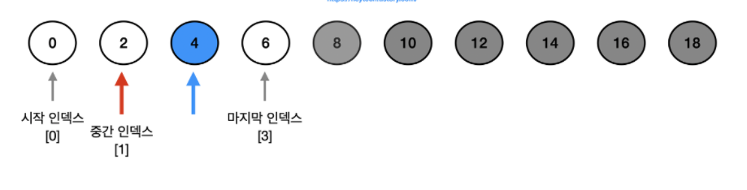
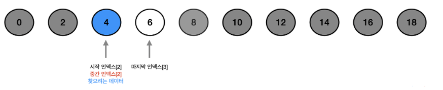

# 순차 탐색(Sequential Search)

## =선형 탐색(Linear Search)

> 리스트 또는 배열 내에서 특정 데이터를 찾기 위해 하나씩 차례대로 확인하는 방법

- 정렬되지 않은 무작위 데이터 내에서 특정 원소를 찾을 때 사용
- 시간복잡도 : O(N)

```python
def sq_search(n, target, arr): 
    for i in range(n): 
        if arr[i] == target: 
            return i + 1
    return None

arr = ['New York', 'Paris', 'Seoul', 'London', 'Toronto'] 
n = len(arr) 
target = 'Seoul'
print("{}번째에서 데이터 탐색 종료.".format(sq_search(n, target, arr)))
```


# 이진 탐색(Binary Search)

> 배열 데이터가 정렬되어 있을 경우에만 사용 가능
>
> 탐색 범위를 절반으로 줄여가며 탐색







> 

- 시간복잡도 : O(logN)
- 데이터의 개수가 클 때 사용

```python
def binary_search (arr, target, start, end): 
    while start <= end:
        mid = (start + end) // 2 
        if arr[mid] == target: 
            return mid  
        elif arr[mid] > target: 
            end = mid - 1 
        else: start = mid + 1 
    return None 
arr = [0, 2, 4, 6, 8, 10, 12, 14, 16, 18] 
n = len(arr) 
target = 4
res = binary_search(arr, target, 0, n-1) 
print("{}번째에서 타겟 확인.".format(res + 1))
```


출처 : https://heytech.tistory.com/63
https://heytech.tistory.com/64?category=464168