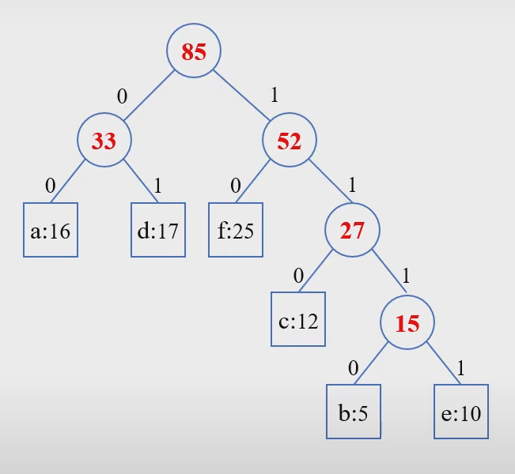

# 허프만 코드(Huffman Code)

#### 데이터를 효율적으로 압축하는데 사용하는 탐욕 알고리즘

- 이진 코드(binary code) : 2진수
  - 데이터 파일을 이진 코드로 인코딩하여 저장 (압축 파일 등)
    - 길이가 고정된 이진 코드(fixed-length)
    - 길이가 변하는 이진 코드(variable-length)
- **허프만 코드** (가변 길이 코드)
  - 허프만 알고리즘에 의해 생성된 최적의 이진 코드
- 허프만 알고리즘
  - 허프만 코드에 해당하는 이진트리를 구축하는 탐욕 알고리즘
  - 데이터를 효율적으로 압축하는데 사용

ex) 압축하고자 하는 문자열 : "ABBCCCDDDDEEEEEFFFFFF"

<압축 결과>

고정 길이 코드 : 000001001010010010011011011011100100100100100101101101101101101

가변 길이 코드 : 100010011001101101101000000000101010101111111111111

### 구현 과정

1. 주어진 텍스트에서 각 문자의 출현 빈도수 계산 (길이 85의 텍스트)

   | b    | e    | c    | a    | d    | f    |
   | ---- | ---- | ---- | ---- | ---- | ---- |
   | 5    | 10   | 12   | 16   | 17   | 25   |

2. 빈도가 작은 노드 두 개를 삭제하고 빈도의 합으로 만들어진 노드를 생성한다.

3. 삭제된 값 중 작은 값은 새로 생성된 노드의 왼쪽 노드, 큰 값은 오른쪽 노드로 추가

#### 결과

- 고정 길이 코드

  | b    | e    | c    | a    | d    | f    |
  | ---- | ---- | ---- | ---- | ---- | ---- |
  | 000  | 001  | 010  | 011  | 100  | 101  |

  길이 85 x 3bit = 255bit

- 가변 길이 코드

  - 각 리프노드를 거꾸로 읽어 허프만 코드 생성

  | b    | e    | c    | a    | d    | f    |
  | ---- | ---- | ---- | ---- | ---- | ---- |
  | 0111 | 1111 | 011  | 00   | 10   | 01   |

  길이 : 5x4bit + 10x4bit + 12x3bit + 16x2bit + 17x2bit + 25x2bit = 212bit

  

  - 빈도수가 높은 문자가 비트를 적게 사용하므로 효율적

  

#### #

구현 코드가 궁금하시면 참고하세요 
https://www.codetd.com/ko/article/6844165

#### 참고

https://withhamit.tistory.com/12