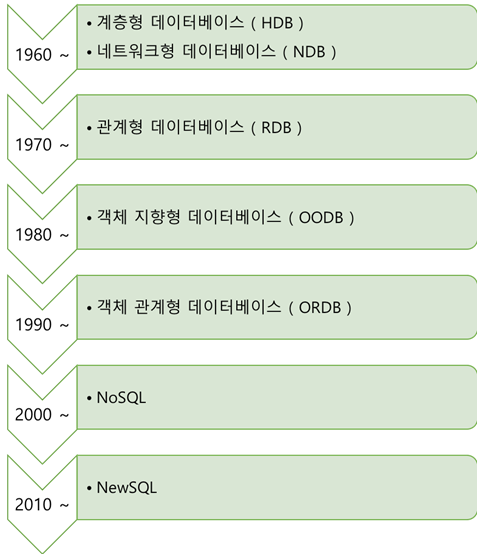
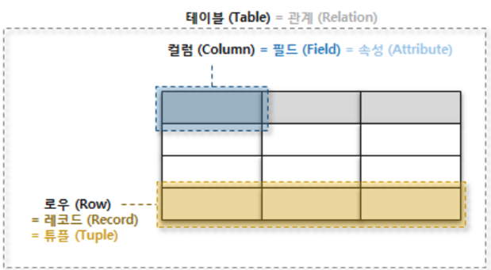

# DB Intro

> 작성자: 김정빈

 

### DataBase

여러 사람들이 공유하고 사용할 목적으로 통합 관리되는 데이터들의 모임

*데이터란? 컴퓨터가 처리 할 수있는 문자, 소리, 그림 등의 형태로 된 자료를 의미*

 **DB를 사용하는 이유?**

DB 이전에 사용하던 File system의 단점 때문 (하지만 현재도 부분적으로 사용하고 있음)

 

---

#### 기존 File system의 단점

* **데이터 간 불일치가 발생할 수 있다**

  중복된 데이터의 변경을 제어하는 것이 어렵기 때문에, 여러개의 중복 데이터 중 일부의 데이터만 변경된다고 하면, 중복된 데이터 간에 불일치가 발생할 수 있다

* **다수 사용자를 위한 동시성 제어가 제공되지 않는다**

  두 사용자가 동시에 파일에 접근 할 때 각 사용자가 혼자서 데이터베이스를 접근하는 것 처럼 인식하도록 하는 동기화가 되지 않는다

* **SQL같은 질의어가 없다**

* **보안 기능이 미흡하다**

  파일 시스템에서는 파일 단위로만 검색, 갱신, 실행 권한을 부여할 수 있어서 사용자의 권한에 따른 세밀한 접근제어(레코드 단위)를 실행하기 어렵다

* **회복 기능이 없다**

  응용프로그램에서 파일 내의 데이터를 수정하는 도중에 강제로 파일이 닫히는 등의 사고가 발생했을 떄 데이터를 복구하는 기능이 없다

* **데이터 독립성이 없어 유지보수 비용이 크다**

  파일의 구조가 응용 프로그램에 반영되어 있기 때문에 파일의 구조가 바뀌면 영향을 받는 모든 응용 프로그램들을 수정해야 한다. 
  또, 응용 프로그램의 기능을 확장하려면 파일의 구조에 대한 요구사항이 바뀌므로 파일을 재조직 해야 함 => 유지보수 짱 많이 발생

* **데이터 무결성을 유지하기가 어렵다**

  파일 내의 데이터가 만족시켜야 하는 무결성 제약 조건들을 명시하려면 프로그래머가 직접 프로그래밍 언어를 사용하여 일일이 프로그램에 표현 해 주어야 함 => 데이터 무결성 유지 어려움!!
  또한 새로운 제약조건들을 주가하거나 기존의 제약조건을 수정하는 것도 어렵다

  *[참고자료] https://m.blog.naver.com/qbxlvnf11/221127762091*

 

---

#### 데이터베이스의 장점

1. **데이터 독립성**
   물리적 독립성 : 데이터베이스 사이즈를 늘리거나 성능 향상을 위해 데이터파일을 늘릴때, 새롭게 추가할 때에도 관련된 응용 프로그램을 수정할 필요 없다

   논리적 독립성 : 데이터베이스는 논리적으로 독립되어 다양한 응용프로그램의 논리적인 요구를 만족 시켜 줄 수 있다
   (파일구조가 바뀌게 되어도 전체 응용 프로그램을 수정 할 필요가 없다)

2. **데이터 무결성**
   데이터의 정확성과 일관성을 유지하고 보증하는 것, 데이터의 무결성은 유효성 검사를 통해 유지된다

3. **데이터 보안성**
   허가된 사용자들만 데이터베이스나 데이터베이스 내의 자원에 접근 할 수 있도록 계정 관리 또는 접근 권한을 설정함 으로서 모든 데이터에 보안을 구현할 수 있다

4. **데이터 일관성**
   연관된 정보를 논리적인 구조로 관리함으로써 어떤 하나의 데이터라도 수정 되었을 경우 연관된 모든 데이터에 반영됨

5. **데이터 중복 최소화**

   데이터를 통합 관리함으로써 데이터 중복 문제를 해결한다

 

---

#### RDBMS

> Relational Database Management System

관계형 으로 테이블이 서로 연결되어있어 일반 DBMS보다 효율적으로 데이터를 저장, 구성 및 관리 할 수 있다

정규화를 통해 데이터의 중복을 최소화하며, 트랜잭션을 수행하는 것이 더 쉽다

데이터의 원자성, 일관성, 격리 및 내구성을 유지하며 데이터 무결성을 높임

RDBMS 소프트웨어로는 MySQL, SQLite, PostgreSQL, ORACLE, MS SQL 등이 존재

 

##### 용어 및 개념

- 열
- 컬럼 
- 스키마 - 데이터베이스에서 자료구조, 표현방법, 관계 등 전반적 명세를 기술한 것
- 테이블 - 열과 행으로 조직된 데이터 요소들의 집합
- 기본 키 - 각 행의 고유 값이자 반드시 설정해야 하는 값

 

#####  **RDBMS 세부 특징**

1. 데이터의 분류, 정렬, 탐색 속도가 빠르다
2. 신뢰성이 높고 데이터의 무결성을 보장한다
3. 기존의 작성된 스키마 수정이 어렵다
4. 데이터베이스의 부하를 분석하는 것이 어렵다

 

---

#### NoSQL

> Not only SQL

스키마X, 관계X, SQL만을 사용하지 않고 다양한 방법으로 저장을 지원함을 의미

관계형 모델을 사용하지 않으며 테이블간의 조인 기능 없음

대부분 여러 대의 데이터베이스 서버를 묶어서(클러스터링) 하나의 데이터베이스를 구성관계형 데이터베이스에서는 지원하는 Data처리 완결성(Transaction ACID 지원) 미보장
데이터의 스키마와 속성들을 다양하게 수용 및 동적 정의 (Schema-less)

데이터베이스의 중단 없는 서비스와 자동 복구 기능지원

다수가 Open Source로 제공

확장성, 가용성, 높은 성능

NoSQL은 초고용량 데이터 처리 등 성능에 특화된 목적을 위해, 비관계형 데이터 저장소에, 비구조적인 데이터를 저장하기 위한 분산 저장 시스템

Key, Value 값으로만 나타내며 스키마 규경에 맞춰서 데이터를 다루지 않아도 된다는 장점 때문에 RDBMS보다 대용량 데이터의 관리에 유리

[참고자료] https://www.samsungsds.com/kr/insights/1232564_4627.html

 

---

