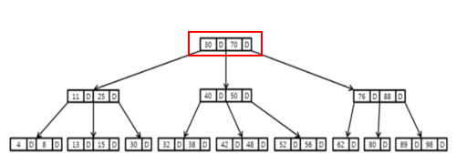
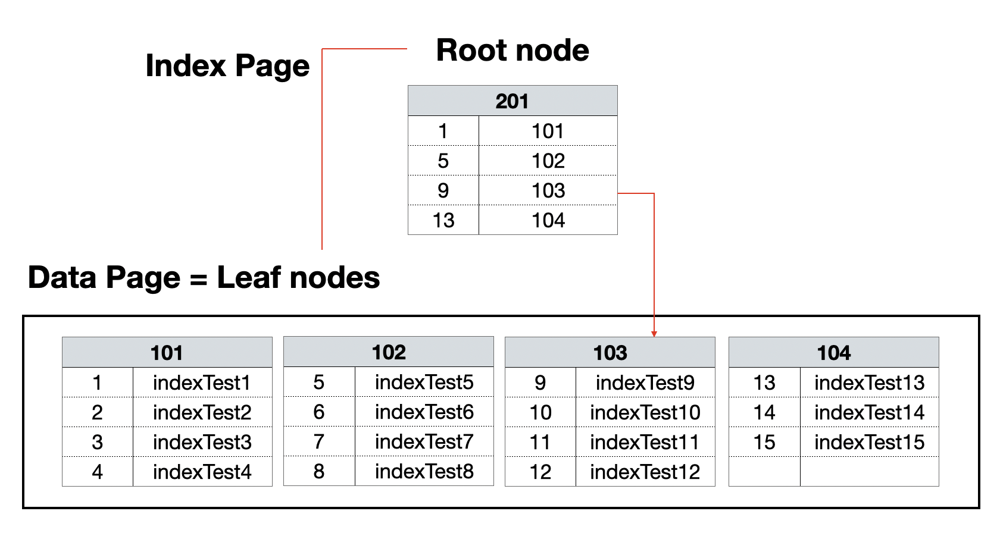
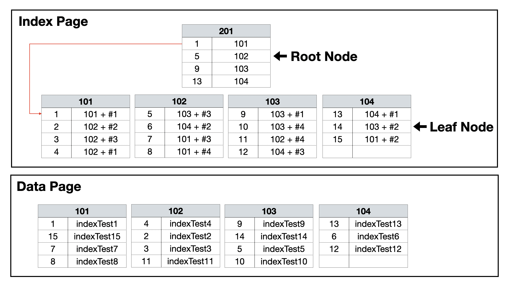

# DB_Index

> 인덱스란 데이터를 빠르게 찾을 수 있는 수단으로, <u>추가적인 쓰기 작업과 저장 공간을 활용</u>하여 데이터베이스 테이블에 대한 조회 속도를 높여 검색 성능을 높여주는 자료 구조이다. 인덱스는 테이블의 특정 레코드 위치를 알려 주는 용도로 사용한다.

ex) 책의 색인, 주민번호 등등 어떤 무언가를 특정하여 찾아오기 위한 키

### 0. 인덱스는 왜 쓰는 걸까?

* 대용량 데이터 조회 시 SELECT 문의 조회 속도를 향상시키기 위해! 단, INSERT, UPDATE, DELETE의 성능을 약간 희생시킨다. 
* Q. 대용량이 아닐 때에는 인덱스를 이용하는게 오히려 비 효율적일까?
  * YES! 인덱스를 만드는 시간이 찾는 시간보다 더 걸릴 수 있기 때문

 

### 1. 인덱스의 특징

* 인덱스는 항상 정렬된 상태를 유지해야 한다
  * 책의 색인도 오름차순으로 정렬되어 있다
* 테이블의 컬럼에 인덱스가 없는 경우 테이블의 전체 내용을 검색한다(Table Full Scan)
* 인덱스가 생성되어 있을 때는 인덱스에 따라 검색한다(Index Range Scan)

 

### 2. 인덱스의 자료구조

##### 2.1 B-Tree (Balanced tree)

* 이진트리를 확장해 하나의 노드가 가질 수 있는 자식 노드의 최대 숫자가 2보다 큰 트리 구조
* 모든 리프 노드들이 같은 레벨을 가질 수 있도록 자동으로 균형(balance)을 맞추는 트리
* 정렬된 순서를 보장하고, 멀티레벨 인덱싱을 통한 빠른 검색을 할 수 있기 때문에 DB에서 제일 많이 사용하는 자료 구조이다

​		Multi Level Indexing(멀티레벨 인덱싱) : 다단계 인덱스, 인덱스를 위한 인덱스, 브랜치 노드를 말한다

**2.2 Hash** : key-value 형태로 데이터를 저장하는 자료구조, 내부적으로 배열을 사용하여 데이터를 저장하기 때문에 빠른 검색속도를 제공한다

**2.3 B+Tree** : B-tree의 확장된개념으로 b-tree는 모든 노드에 데이터를 저장했지만 b+tree는 리프노드(말단노드)만 값을 가지고 있다

 

### 3. 인덱스의 종류

##### 1.1 Clustered(클러스터드)

* Clurster : 군집의, Clurstered Index : 군집된 인덱스

* 테이블 내부에 생성되어 1개만 사용 가능하다 (PK와 비슷한 개념)
  * 정렬되는 기준을 정해주는 것이기 때문에
* 인덱스에 데이터 페이지가 함께 존재 (인덱스와 데이터가 같이)
* 특정 범위 스캔시 유리하다
* 데이터 INSERT시 좋지 못한 효율을 낸다

##### 1.2 Non-clustered(넌-클러스터드)

* 별도의 페이지에 인덱스를 구성한다
* 인덱스의 키 값만 정렬될 뿐 실제 데이터는 정렬되지 않는다
* 검색 속도는 느리지만, 데이터의 입력, 수정, 삭제가 더 빠르다

|                    | 클러스터드 인덱스          | 넌-클러스터드 인덱스              |
| ------------------ | -------------------------- | --------------------------------- |
| 배열               | 행을 물리적으로 재배열한다 | 행을 물리적으로 재배열하지 않는다 |
| 크기               | 인덱스 페이지 용량이 작다  | 인덱스 페이지 용량이 크다         |
| 선택도             | 30% 이내 사용 권장         | 3% 이내 사용 권장                 |
| 테이블당 사용 갯수 | 1개                        | 249개                             |

 

### 4. 인덱스가 항상 좋은걸까?

##### 4.1 장점

* 테이블을 조회하는 속도와 그에 따른 성능을 향상시킬 수 있다
* 전반적인 시스템의 부하를 줄일 수 있다

##### 4.2 단점

* 처음 인덱스를 생성하는데 시간이 많이 소요될 수 있다
* 인덱스를 관리하기 위해 DB의 약 10%에 해당하는 저장공간이 필요하다

* 인덱스를 관리하기 위해 추가 작업이 필요하다(정렬 등)
* 인덱스를 잘못 사용할 경우 오히려 성능이 저하되는 역효과가 발생할 수 있다
  * 데이터의 변경 작업이 자주 일어나는 테이블에 사용한 경우

##### 4.3 Cardinality(카디널리티) 와 Selectivity(선택도), 활용도, 중복도

* 어떤 컬럼에 인덱스를 설정하는게 좋을지 정할 수 있는 기준이 된다
* 인덱스 사용 효율을 가늠할 수 있는 척도가 될 수 있다

>  **4.3.1 카디널리티**
>
> 컬럼에 사용되는 값의 다양성 정도, 즉 중복 수치를 나타내는 지표. 후보 컬럼에 따라 상대적으로 중복 정도가 낮다, 높다로 표현
> 카디널리티가 높을 수록 인덱스 설정에 좋은 컬럼이다

> **4.3.2 선택도**
>
> 데이터에서 특정 값을 얼마나 잘 선택할 수 있는지에 대한 지표, 5~10%가 적당하다. 
> 선택도가 낮을 수록 인덱스 설정에 좋은 컬럼이다

> **4.3.3 활용도**
>
> 해당 컬럼이 실제 작업에서 얼마나 활용되는지에 대한 값
> 활용도가 높을 수록 인덱스 설정에 좋은 컬럼이다

> **4.3.4 중복도**
>
> 중복 인덱스 여부에 대한 값, 인덱스는 테이블 형태로 생성되므로, 속성을 컬럼으로 관리한다. 속성이 다를 때 같은 컬럼에 대해 중복으로 인덱스 설정이 가능하다. 인덱스도 결국 메모리의 일부이므로 필요 없는 항목은 삭제하는게 좋다
> 중복도가 없을 수록 인덱스 설정에 좋은 컬럼이다

| 기준       | 정도                       |
| ---------- | -------------------------- |
| 카디널리티 | 높을수록 적합              |
| 선택도     | 낮을 수록 적합(5~10% 적정) |
| 활용도     | 높을수록 적합              |
| 중복도     | 없을수록 적합              |

 

----

##### Interview

Q. 인덱스란?

Q. 클러스터드, 넌-클러스터드 인덱스의 차이점을 설명하세요

----

