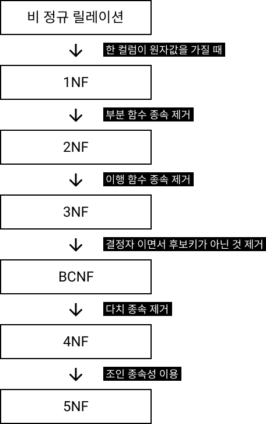
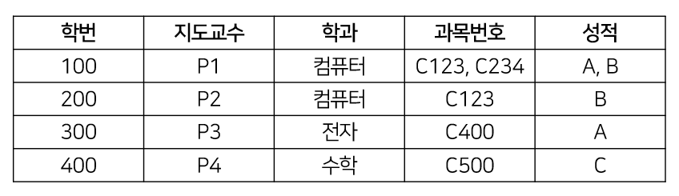
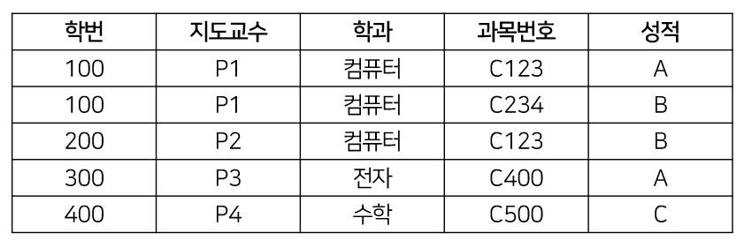
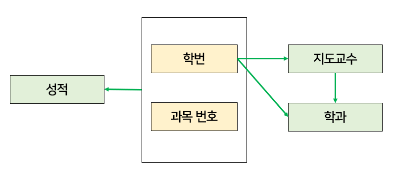
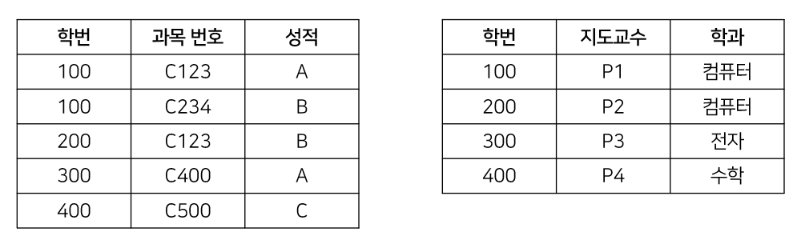
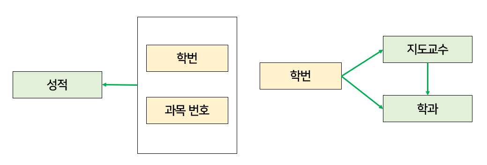
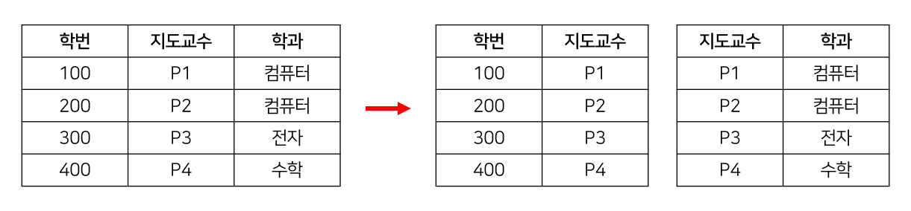
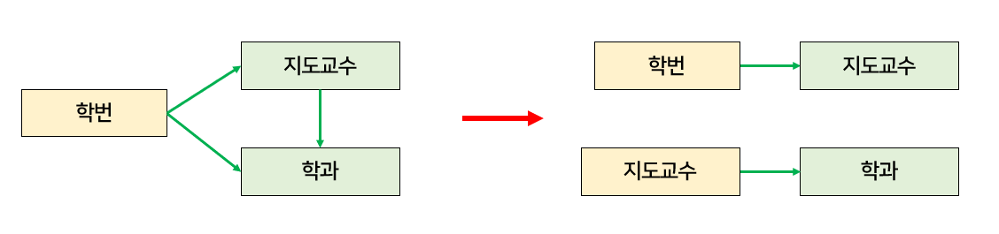
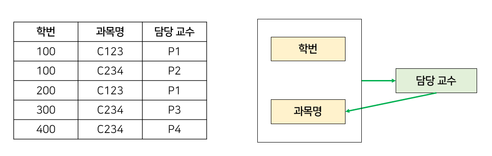
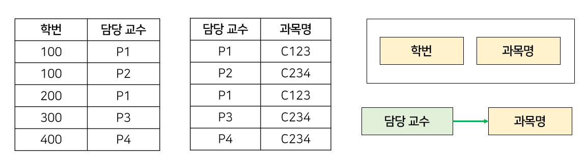

# 정규화(Normalization)

> 1. 한 테이블(릴레이션)에서 <u>중복된 데이터를 허용하지 않게</u> 분해 하는 프로세스
> 2. 관계형 데이터베이스의 설계에서 중복을 최소화 하여 <u>이상 현상을 없애는</u> 과정
>
> 즉, 불필요한 데이터 중복으로 발생하는 공간낭비 또는 부작용을 막기 위해 데이터를 구조화하는 작업

 

### 0. 이상(Anomarly) 현상

데이터의 중복성으로 인해 릴레이션을 조작할 때 발생하는 비합리적 현상

| 이상 현상     | 설명                                                         |
| ------------- | :----------------------------------------------------------- |
| **삽입 이상** | 정보 저장 시 원하는 정보 의외의 자료가 삽입되는 경우나 해당 정보의 불필요한 세부정보를 입력해야 하는 경우  |
| **삭제 이상** | 정보 삭제 시 원치 않는 다른 정보가 같이 삭제되는 경우        |
| **갱신 이상** | 중복 데이터 중에서 특정 부분만 수정되어 중복된 값이 모순을 일으키는 경우 |

 

### 1. 정규화의 목적

* 데이터 구조의 안정성과 무결성을 유지하기 위해서
* 데이터 모형의 단순화가 가능 > DB 구조 확장 시 재 디자인을 최소화
* 효과적인 검색 알고리즘, 인덱스를 생성 가능
* <u>데이터 중복을 배제하여 이상 현상을 방지하고 저장 공간을 최소화 할 수 있음</u>

 

테이블을 분해하는 기준은 `함수적 종속성`에 따르며 등급을 구분할 수 있다

**함수적 종속**이란 어떤 릴레이션 R이 있을 때 X, Y를 각각 속성의 부분집합이라고 가정할 때 X의 값을 알면 Y의 값을 바로 식별 할 수 있고, X의 값에 의해 Y 값이 달라질 때 Y는 X에 함수적 종속이라고 할 수 있다. 이 경우 **X를 결정자, Y를 종속자**라고 한다(X ➡ Y). 함수적 종속 관계는 `완전 함수적 종속`, `부분 함수적 종속`, `이행적 함수 종속`이 있다.

 

### 2. 정규화 단계

데이터 모델을 만들고, 데이터베이스에 구현하기 전에 적용하는 것이 좋다.

 

##### 2.1 제 1 정규형 (1NF)

* 테이블의 하나의 속성은 하나의 값만 가지고 있도록 분해하는 것, 즉 속성 값이 모두 원자값으로 구성되어야 한다.
* 이 조건을 만족하면 1NF를 만족했다 라고 표현한다.

 

**[제 1 정규형에서 발생할 수 있는 이상현상]**

1. 삽입 이상 : 학생이 새 과목을 수강 신청할 때 반드시 학생의 학과와 지도교수를 알아야 한다. (불필요한 정보)
2. 삭제 이상 : 300번 학생이 C400을 취소하면, 해당 과목에 대한 모든 정보가 사라진다. (하나의 행이 사라지기 때문)
3. 갱신 이상 : 100번 학생이 지도교수를 변경할 때 100의 P1인 행을 모두 찾아 지도교수를 변경해 주어야 한다.

1NF에서 이상현상이 발생하는 이유는 기본키가 아닌 속성들이 기본키에 완전 함수 종속되지 못하고 부분 함수 종속되어있기 때문이다. 즉 기본키의 일부 속성에만 의존하고 있기 때문이다.

 

##### 2.2 제 2 정규형 (2NF)

* 릴레이션이 1NF를 만족하고, 기본 키가 아닌 모든 속성이 기본 키에 완전 함수 종속일 때

* **완전 함수 종속 ?**

  | 회원번호    | 이름   | 나이 | 거주지 |
  | ----------- | ------ | ---- | ------ |
  | <u>A001</u> | 송민지 | 17   | 서울   |
  | <u>A002</u> | 박아람 | 15   | 부산   |
  | <u>A003</u> | 이예은 | 16   | 대전   |

  종속자가 기본키에만 종속되며, 기본키가 여러 속성으로 구성되어 있을 경우 기본키를 구성하는 모든 속성이 포함된 기본키의 부분집합에 종속된 경우

  만약 (속성 A, B) ➡ (속성 C) 일 때, (A➡C) 와 (A➡B) 모두 성립되는 것을 말함, 이 릴레이션에서는 이름, 나이, 거주지를 알려면 기본키인 회원번호를 알아야 식별 가능하다. 따라서 이름, 나이, 거주지역은 회원번호에 완전 함수 종속된 관계이다.

**[제 2 정규형에서 발생할 수 있는 이상현상]**

1. 삽입 이상 : 지도교수가 학과에 소속되어 있음을 추가할 때 반드시 지도 학생이 있어야 한다. (불필요한 정보 필요)
2. 삭제 이상 : 300번 학생이 자퇴하는 경우 P3 교수의 학과정보가 사라진다.
3. 갱신 이상 : 지도교수의 학과가 변경되는 경우, 지도교수의 학생들에 대한 정보를 찾아서 변경시켜주어야 한다.

2NF에서 이상현상이 여전히 발생하는 이유는 이행적 함수 종속성 때문이다.

 

##### 2.3 제 3 정규형 (3NF)

* 제 2NF를 만족하고, 이행적 함수 종속도 존재하지 않을 때 (2NF에서 이행적 함수 종속을 제거한다)

* **이행적 함수 종속 ?**

  | 회원번호    | 이름   | 나이 | 거주지역 |
  | ----------- | ------ | ---- | -------- |
  | <u>A001</u> | 송민지 | 17   | 서울     |
  | <u>A002</u> | 박아람 | 15   | 부산     |
  | <u>A003</u> | 이예은 | 16   | 대전     |

  릴레이션에서 X, Y, Z라는 3개의 속성이 있을 때, (X ➡ Y), (Y ➡ Z), (X ➡ Z)가 성립 될 때를 말함. 즉 X를 알면 Y를 알 수 있고 그를 통해 Z까지 알수 있는 경우를 말한다

  이 릴레이션에서는 회원번호를 알면 이름을 알 수 있고 이름을 알면 나이를 알 수 있다. 따라서 이행 함수 종속관계이다.

**[제 3 정규형에서 발생할 수 있는 이상현상]**

1. 삽입 이상 : 새로운 교수가 특정 과목을 담당한다는 새로운 정보를 추가할 수 없다. 적어도 한 명 이상의 수강 학생이 필요하다
2. 삭제 이상 : 학번 100이 C234 과목을 취소하면, P2가 C234 과목을 담당한다는 정보도 삭제된다.
3. 갱신 이상 : P1의 과목이 변경되면 P1인 행을 모두 찾아 변경시켜주어야 한다.

 

##### 2.4 보이스코드 정규형 (Boyce-codd, BCNF)

* 여러 후보 키가 존재하는 릴레이션에 대한 정규화 내용이며 복잡한 식별자 관계에 의해 발생하는 문제를 해결한다. <u>제 3 정규형을 보완하는데 의미</u>가 있고 함수 종속성 (A ➡ B)가 성립할 때 모든 결정자(A)가 후보키이면 BCNF 정규형이라고 한다. 다른 말로는 강한 제 3 정규형이라고도 한다.
* **후보키 ?**
  릴레이션(테이블)을 구성하는 속성들 중에서 튜플을 유일하게 식별하기 위해 사용되는 속성들의 부분집합이다, 즉 기본키로 사용될 수 있는 속성들을 말한다. 후보키가 둘 이상일 때 기본키를 제외한 나머지 후보키들은 대체키(보조키)라고도 불린다.
* 수 많은 정규형들이 있지만 관계 데이터베이스 설계 목표는 각 릴레이션이 3NF or BCNF를 갖게 하는 것이다.
* 즉 대부분 1~3 정규형에만 부합하면 잘 정규화된 데이터베이스로 표현함

제 3 정규형의 이상현상을 해결하기 위해서 모든 결정자는 항상 후보키가 되도록 릴레이션을 분해해주면 강한 제 3 정규형인 보이스코드 정규형을 만족하게 되는 것이다.

 

##### 2.5 제 4 정규형 (4NF)

* 다치(다중) 종속을 제거하는 정규형...

##### 2.6 제 5 정규형 (5NF)

* 릴레이션의 모든 조인 종속이 릴레이션의 후보키를 통해서만 성립되는 정규형...

 

### 3. 정규화의 단점 ?

릴레이션의 분해로 인해 릴레이션 간의 연산(JOIN)이 많아진다. 이로 인해 질의문에 대한 응답 시간이 느려질 수 있다.

---

#### Interview

---

[^정규형 이미지, 설명 참고]: https://rebro.kr/160
[^함수적 종속]: https://dodo000.tistory.com/20
[^설명 굿 참고블로그]: https://3months.tistory.com/193

