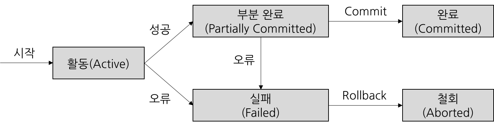

# 트랜잭션 (Transaction)

> 허용되지 않은 사용자로부터 데이터를 보장하기 위해 DBMS가 가져야 하는 특성이자, 데이터베이스 시스템에서 하나의 논리적 기능을 정상적으로 수행하기 위한 작업의 단위

* 트랜잭션은 DB내에서 하나의 그룹으로 처리해야 하는 명령문들을 모아놓은 작업이다 (하나의 SQL문만을 의미하는것이 아님)

 

##### 1. 1 트랜잭션은 왜 필요할까?

​	ex. 은행 송금 처리

* 데이터의 일관성과 무결성을 보장하기 위해서는 반드시 트랜잭션 관리가 필요하다

* 데이터베이스에서 데이터를 다룰 때 장애가 일어나는 경우가 있다. **트랜잭션은 장애 시 데이터를 복구하는 작업의 단위가 된다**
* 데이터베이스에서 여러 작업이 동시에 같은 데이터를 다룰 때가 있다. **트랜잭션은 이 작업을 서로 분리하는 단위가 된다**

 

#### 2. 트랜잭션의 특성 (ACID)

##### 2.1 원자성(Atomicity)

* 분해가 불가능한 작업의 최소단위를 가져야 함

* 트랜잭션의 연산은 데이터베이스에 모두 반영되거나, 모두 반영되지 않아야 한다(All or Nothing)

* 트랜잭션 내의 모든 명령은 반드시 완벽하게 수행되어야 하고 하나라도 실패 하면 트랜잭션 전체가 취소되어야 한다

  주요 기법 : Commit / Rollback / 회복성 보장

##### 2.2 일관성(Consistency)

* 트랜잭션 수행 후 데이터 모델의 모든 제약조건을 만족해야 한다

  ex) 잔고의 데이터 타입은 정수형이어야 한다, 잔고의 값은 null이면 안된다 등의 명시적 제약조건과 송금 전 두사람의 잔고 합과 송금 후 두사람의 잔고 합이 같아야 하는 비명시적 일관성 조건도 지켜져야 한다

  : 무결성 제약조건 / 동시성 제어(=병행 제어)

##### 2.3 격리성(Isolation)

* 트랜잭션이 실행 중 생성하는 연산의 중간 결과를 다른 트랜잭션이 참조할 수 없다

* 즉 트랜잭션 수행 시 다른 트랜잭션이 영향을 미치지 않아야 한다

  : Read Uncommited / Read Commited / Repeatable Read / Serializable

##### 2.4 영속성(Durability)

* 성공한 트랜잭션의 결과는 영구적으로 DB에 반영되어야 한다(기록하여야 한다)

  : 회복기법

 

#### 3. 트랜잭션의 상태 변화

 

#### 4. 트랜잭션 제어

트랜잭션 제어 언어는 TCL(Transaction Control Language)라고 하며, 트랜잭션의 결과를 허용하거나 취소하는 목적으로 사용되는 언어를 지칭한다

| 명령어                                            | 핵심                | 설명                                                         |
| ------------------------------------------------- | ------------------- | ------------------------------------------------------------ |
| 커밋(COMMIT)                                      | 트랜잭션 성공(확정) | 트랜잭션을 DB메모리에 영구적으로 저장하는 명령어 (하나의 트랜잭션 과정을 종료하는 것을 의미하며 이전 데이터가 완전히 UPDATE된다) |
| 롤백(ROLLBACK)                                    | 트랜잭션 실패(취소) | 트랜잭션 처리과정에서 발생한 변경사항을 취소 (트랜잭션이 시작되기 이전의 상태로 되돌림, 즉 마지막 커밋을 완료한 시점으로 돌아감) |
| 체크포인트 = 세이브포인트(CHECKPOINT = SAVEPOINT) | 저장 시기 설정      | ROLLBACK을 위한 시점을 지정하는 명령어 (임시저장과 같음, 현재 트랜잭션을 작게 분할하여 저장해놓은 지점까지만 작업을 취소(ROLLBACK)할 수 있다) |

 

##### 4.1 병행 제어(= 동시성 제어, 일관성 주요 기법)

[^]: 데이터 일관성이란 각각의 유저가 일관된 데이터의 값을 보는것을 말하고, 데이터 동시성이란 여러 유저가 동시에 데이터를 접속할 수 있는 것을 말한다. 동시성과 일관성은 서로 상충관계에 있으며 동시성을 높이려고 락의 사용을 최소화 하면, 읽기 일관성을 유지하기 어렵고, 데이터의 일관성을 높이려고 락을 많이 사용하면 동시성이 떨어지게 된다.

병행 제어는 다수 사용자 환경에서 여러 트랜잭션을 수행할 때, 데이터베이스 일관성 유지를 위해 상호작용을 제어하는 기법이다.

**목적**은 데이터베이스의 공유와 시스템 활용도의 최대화, 데이터베이스의 일관성 유지, 사용자에 대한 응답시간을 최소화하는데 있다.

**병행 제어 기법의 종류**

| 기법                                                         | 설명                                                         |
| ------------------------------------------------------------ | ------------------------------------------------------------ |
| 로킹 (Locking)                                               | 하나의 트랜잭션이 데이터에 접근(갱신) 하는 동안 다른 트랜잭션은 그 데이터를 접근할 수 없게 하는 방법 트랜잭션 처리의 순차성을 보장하기 위한 방법이다 |
| 낙관적 검증                                                  | 트랜잭션이 어떤 검증도 수행하지 않고 일단 트랜잭션을 수행한 후 트랜잭션 종료 시 검증을 수행하여 데이터베이스에 반영하는 방법 Read only 트랜잭션이 대부분일 때 병행제어를 하지 않아도 문제가 생기지 않는 점을 이용한 것 |
| 타임 스탬프 순서 (Time Spamp Ordering)                       | 트랜잭션과 트랜잭션이 읽거나 갱신한 데이터에 대해 트랜잭션이 실행을 시작하기 전에 타임스탬프를 부여하여 부여한 시간에 따라 트랜잭션 작업을 수행하는 방법 타임스탬프로 순서를 미리 정하여 제어하는 기법이다 |
| 다중버전 동시성 제어 (MVCC; Multi Version Concurrency Control) | 트랜잭션의 타임스탬프와 접근하려는 데이터의 타임스탬프를 비교하여 직렬가능성이 보장되는 적절한 버전을 선택하여 접근하도록 하는 기법 |

직렬성? 여러 트랜잭션이 동시에 병행 수행되더라도 각 트랜잭션이 하나씩 차례대로 수행되는 것과 같은 데이터베이스의 일관성을 보장하는 수행특성

##### 로킹(Locking)

* 공유 락(Shared lock = read lock)
  데이터를 읽을 때 사용되는 Lock으로 공유 락 끼리는 동시에 접근이 가능하다(하나의 데이터를 읽는 것은 여러 사용자가 동시에 할 수 있다). 하지만 공유 락이 설정된 데이터에 배타 락을 사용할 수는 없다
* 배타 락(Exclusive lock = write lock)
  데이터를 변경할 때 사용되는 Lock으로 트랜잭션이 완료될 때까지 유지된다. 배타 락은 락이 해제될 때까지 다른 트랜잭션(읽기 전용인 공유락 포함)이 데이터에 접근할 수 없다. 또한 배타 락은 다른 트랜잭션이 수행되고 있는 중인 데이터에 대해서는 접근하여 락을 설정 할 수 없다
* 락 설정 레벨(Lock level)
  1. Row level 
     변경하려는 row에만 락을 설정함
  2. Page level
     변경하려는 row가 담긴 데이터 page(또는 인덱스 페이지)에 락을 설정함, 같은 페이지에 속한 열들은 변경 작업과 무관하게 모두 락에 의해 잠긴다
  3. Table level
     테이블과 인덱스 모두에 락을 설정함
  4. Database level
     데이터베이스 전체에 락을 설정함, 데이터베이스를 복구하거나 스키마를 변경할 때 발생함
* 블로킹(Blocking)
  락에 의해 특정 트랜잭션이 진행하지 못하고 멈춰선 상태를 말한다. 예를들어 공유락 끼리는 블로킹이 발생하지 않지만 배타락은 블로킹을 발생시킨다. 블로킹을 해소하기 위해서는 이전의 트랜잭션이  완료(커밋/롤백)되어야 한다. 보통 트랜잭션은 하나의 트랜잭션이 끝나고 실행되기 때문에 멈춰서게 되는 것을 의미한다.
* 데드락(Dead lock)
  블로킹이 심화되어 멈춰선 상태이며 교착상태라고 한다. 두 트랜잭션이 각각 락을 설정한 채 서로의 락에 접근하여 값을 가져오려고 할 때 이미 각각의 트랜잭션에 의해 락이 설정되어 있기 때문에 양쪽 트랜잭션 모두 영원히 처리가 되지 않게 되는 상태를 의미한다(상대방을 기다리며 실행하지 못한 채 무한정 기다리게 됨)

**병행 제어의 필요성**

| 문제점                        | 설명                                                         |
| ----------------------------- | ------------------------------------------------------------ |
| 갱신 손실 (Lost Update)       | 먼저 실행된 트랜잭션의 결과를 나중에 시행된 트랜잭션이 덮어쓸 때 발생하는 오류 같은 데이터를 공유하여 갱신할 때 갱신 결과의 일부가 사라지는 현상 |
| 현황 파악 오류 (Dirty Read)   | 트랜잭션의 중간 수행 결과를 다른 트랜잭션이 참조하여 발생하는 오류 아직 커밋되지 않은 트랜잭션의 내용을 읽으려고 하는 현상 |
| 모순성 (Inconsistency)        | 두 트랜잭션이 동시에 실행되어 데이터베이스의 일관성이 결여되는 오류 같은 데이터를 동시에 갱신할 때 데이터 간의 상호 불일치가 발생하는 현상 |
| 연쇄복귀 (Cascading Rollback) | 복수의 트랜잭션이 데이터 공유 시 특정 트랜잭션이 처리를 취소할 경우 트랜잭션이 처리한 곳의 부분을 취소하지 못하는 오류 트랜잭션 중 하나에 문제가 생겨 Rollback 되는 경우 다른 트랜잭션들도 함께 Rollback되는 현상 |

 

##### 4.2 데이터베이스 고립화 수준(=격리 수준, 격리성 주요 기법)

**격리성으로 인해 나타날 수 있는 문제점**

| 문제점              | 설명                                                         |
| ------------------- | ------------------------------------------------------------ |
| Dirty Road          | 다른 트랜잭션에 의해 수정되었지만 아직 커밋되지 않은 데이터를 읽는 것 |
| Non-Repeatable Read | 한 트랜잭션 내에서 같은 key를 가진 행을 두 번 읽었는데 그 사이에 값이 변경되거나 삭제되어 결과가 다르게 나타나는 것 |
| Phantom Read        | 한 트랜잭션 내에서 쿼리를 두번 수행했는데, 첫번째 쿼리에서 없던 유령(phantom) 레코드가 두번째 쿼리에서 나타나는 것 |

* Non-Repeatable Read와 Phantom Read의 차이점?
  Non... 는 1개 행의 데이터 값이 변경되는 것이고, Phan... 는 여러건을 요청하는 것에 대해서 데이터 값이 변경되는 것이다

**지정할 수 있는 고립화 수준?**

다른 트랜잭션이 현재의 데이터에 대한 무결성을 해지치 않기 위해 잠금을 설정하는 정도이다
종류는 Read Uncommited , Read Commited, Repeatable Read, Serializable 가 있다

| 수준                          | 설명                                                         |
| ----------------------------- | ------------------------------------------------------------ |
| Read Uncommited (레벨 0) | 한 트랜잭션에서 연산(갱신) 중인 (아직 커밋되지 않은) 데이터를 다른 트랜잭션이 읽는 것을 허용하는 수준 연산 중인 데이터에 대한 연산은 허용하지 않음 해당 수준에서 격리성으로 인해 나타날 수있는 문제점 3가지가 모두 발생할 가능성이 있다 |
| Read Commited (레벨 1)   | 한 트랜잭션에서 연산을 수행할 때, 연산이 완료될 때까지 연산 대상 데이터에 대한 읽기를 제한하는 수준 연산이 완료되어 커밋된 데이터는 다른 트랜잭션이 읽는 것을 허용(dirty read의 발생 가능성 해결) 문제점 Non-repeatable read와 phantom read가 발생할 가능성이 있다 |
| Repeatable Read (레벨 2) | 선행 트랜잭션이 특정 데이터를 읽을 때, 트랜잭션 종료 시까지 해당 데이터에 대한 갱신/삭제를 제한하는 수준 |
| Serializable  (레벨 3)   | 선행 트랜잭션이 특정 데이터 영역을 순차적으로 읽을 때, 해당 데이터 영역 전체에 대한 접근 제한하는 수준 |

레벨 0과 레벨3은 잘 쓰이지 않는다

 

##### 4.3 회복 기법 (영속성 주요 기법)

트랜잭션을 수행하는 도중 장애로 인해 손상된 데이터베이스를 손상되기 이전의 정상적인 상태로 복구시키는 작업이다

**종류**로는 로그 기반 회복기법인 지연 갱신 회복 기법, 즉시 갱신 회복 기법 / 체크 포인트 회복 기법 / 그림자 페이징 회복 기법이 있다

| 기법                                             | 설명                                                         |
| ------------------------------------------------ | ------------------------------------------------------------ |
| **로그 기반 회복 기법**                          | 지연 갱신 회복 기법(Deferred Update) : 트랜잭션이 완료되기 전까지 데이터베이스에 기록하지 않는 기법 즉각 갱신 회복 기법(Immediate Update) : 트랜잭션 수행 중 갱신 결과를 바로 DB에 반영하는 기법 |
| 체크 포인트 회복 기법 (Checkpoint Recovery)      | 장애 발생 시 Checkpoint 이후에 처리된 트랜잭션에 대해서만 장애 발생 이전의 상태로 복원시키는 회복 기법 |
| 그림자 페이징 회복 기법 (Shadow Paging Recovery) | 데이터베이스 트랜잭션 수행 시 복제본을 생성하여(백업) 데이터베이스 장애시 이를 이용해 복구하는 기법 |

 

#### 5. 트랜잭션을 사용하며 주의해야 할 점?

트랜잭션은 데이터의 완전성을 보장하기 위해 많은 자원들을 사용하게 된다. 자원을 사용하며 Lock을 걸게 되면 다른 사용자들은 Lock이 해제될 때까지 기다려야 한다. 기다린다는 것은 성능에 좋지 않다는 의미이다. 따라서 트랜잭션의 범위를 최소화하여 적용하는 것이 좋다.

---

#### Interview

Q1. 트랜잭션이란 무엇인가요? 4가지 원칙을 포함해서 설명해주세요

Q2. DB에서의 commit와 rollback 이란?

Q3. 트랜잭션의 격리 수준과 각 수준에서 발생할 수 있는 문제들에 대해 설명해주세요

Q4. 공유 락(shared)과 배타(exclusive) 락의 차이는 무엇인가요?

Q5. 데드 락이란 무엇이며, 어떻게 발생되나요?

---

[참고1]: https://nesoy.github.io/articles/2018-05/Database-Transaction	"참고1"
[이미지참고1]: https://jerryjerryjerry.tistory.com/48	"이미지참고1"
[DBMS 전반]: https://d2.naver.com/helloworld/407507	"읽어보면 좋은 글"

