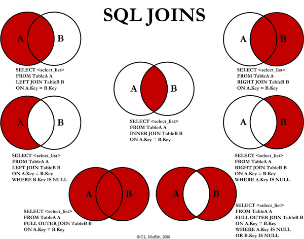

# SQL Join

#### 1. 조인?

두 개 이상의 테이블이나 **데이터베이스를 결합하여 데이터를 검색하는 방법**, 여러 테이블에 흩어져 있는 정보 중 사용자가 필요한 정보만 가져와 가상의 테이블 처럼 만들어 결과를 보여준다. 보통 Primary Key 또는 Foreign Key로 두 테이블을 연결하고, 테이블들이 적어도 하나의 컬럼을 공유하고 있어야 한다. 

##### 1.1 필요성

관계형 데이터베이스는 정규화 과정을 거치며 여러 개의 테이블로 나뉘어 저장함. 이 때 여러 개의 테이블에 저장된 데이터를 효과적으로 검색하기 위해서 Join을 이용한다.

##### 1.2 주의사항

SQL문을 어떻게 작성하느냐에 따라 DB 성능 즉 서버 자원의 효율적 사용성이 좌우되므로 원하는 로직을 잘 파악하여 Join을 사용하여야 한다.

 

#### 2. 조인의 종류

##### 2.1 내부조인(Inner Join)

* Join 한 두 테이블의 **중복된 값**을 보여줌 - 쉽게 말하면 교집합

##### 2.2 외부조인(Outer Join 또는 Full Outer Join)

* Join 하는 두 테이블 사이 매칭되는 행이 없어도 **모든 값을 가져오며**, 컬럼에 데이터가 없으면 테이터를 Null로 표시 - 쉽게 말하면 합집합

  ##### 2.2.1 Left Join

  * Join 하는 기준 테이블은 왼쪽 테이블, A 값의 전체와 A 값과 일치하는 B 테이블의 데이터를 연결

  ##### 2.2.2 Right Join

  * Join 하는 기준 테이블은 오른쪽 테이블, B 값의 전체와 B 값과 일치하는 A 테이블의 데이터를 연결

  ###### Left, Right Join은 where 절을 사용하여 Null을 제외시켜 순수 A, B 테이블의 값 만 뽑을 수도 있다.

##### 2.3 교차조인(Cross Join)

* 두 테이블 사이에서 나올 수 있는 **모든 경우의 수만큼** Join, 결과 집합은 A*B 레코드수 만큼 생성되며 Join되는 테이블에 공통되는 행이 없어도 실행된다. 모든 경우의 수를 도출하는 만큼 연결 조건인 ON 절이 없고 WHERE만 사용한다.

##### 2.4 자가조인(Self Join)

* **자신의 테이블 다른 열을 다른 별칭으로 가져 와** Join시키는 방법. 자신이 가지고 있는 컬럼을 다양하게 변형시켜 활용 할 경우에 사용

 

#### etc. 주요 면접 질문

* Join이란?
* 내부 조인(Inner Join)과 외부 조인(Outer Join)의 차이점?

[JOIN 참고 사이트](https://sql-joins.leopard.in.ua/)

###### 가장 많이 쓰이는 Join은 Inner Join이다.

### QnA

[**[ON vs WHERE]**](https://developyo.tistory.com/121)

**ON** : JOIN 을 하기 전 필터링을 한다 (=ON 조건으로 필터링이 된 레코들간 JOIN이 이뤄진다)

**WHERE** : JOIN 을 한 후 필터링을 한다 (=JOIN을 한 결과에서 WHERE 조건절로 필터링이 이뤄진다)

 

**[Outer Join 에서 Null?]**

| 책번호 | 책명       | 책번호 | 가격   |
| ------ | ---------- | ------ | ------ |
| 111    | 운영체제   | 111    | 20,000 |
| 222    | 자료구조   | 222    | 25,000 |
| null   | null       | 333    | 10,000 |
| null   | null       | 444    | 15,000 |
| 555    | 컴퓨터구조 | null   | null   |

