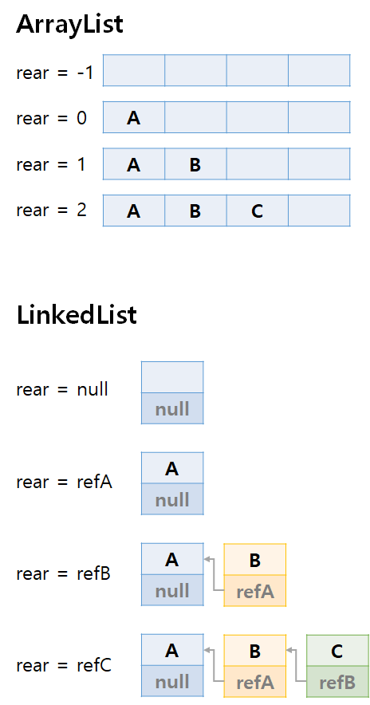

# 데이터 구조

> 작성자: 김주호

## 스택

>스택 구조?
>
>어떻게 구현할 수 있을까?

## 스택 구조

> 데이터의 흐름을 생각해보자

### LIFO

- Last In, First Out
- 마지막에 들어온 자료가 가장 먼저 빠져나간다
- 뒤로가기, 실행취소, 수식괄호 등

## 스택의 구현

### ArrayList

- rear를 선언

  - List의 맨 마지막 idx를 저장

- 비어있다면 rear==-1

- 값을 추가한다면 rear += 1, List[rear] = SomeData

  

### LinkedList

- rear를 선언
  - **추가되는 맨 뒤 List의 ref**를 저장
- 비어있다면 rear == null
- 값을 추가한다면 노드 생성 후 LinkedList의 **맨 뒤**에 추가, 노드의 주소는 이전 노드 ref로 지정
  - rear의 ref를 방금 추가한 노드 ref로 변경

---

### Next: 들어오는 순서대로 빠져나가는 구조도 필요한데..?