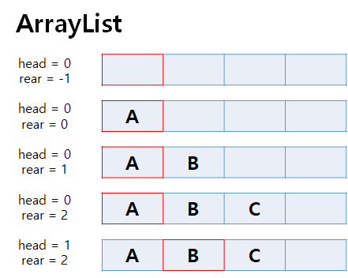

# 데이터 구조

> 작성자: 김주호

## 큐

>큐 구조?
>
>어떻게 구현할 수 있을까?

## 큐 구조

> 데이터의 흐름을 생각해보자

### FIFO

- First In, First Out
- 들어온 순서대로 자료가 빠져나간다
- 일상생활의 대부분은 이 구조를 따름

## 큐의 구현

### ArrayList - 선형 큐

- 구현

  - head, rear를 선언
  - head는 맨 List의 맨 앞 idx, rear는 List의 맨 마지막 idx를 저장
  - 비어있다면 head == 0, rear == -1
  - 값을 추가한다면 rear += 1, List[rear] = SomeData
  - 값을 삭제한다면 head += 1

- 장점

  - 손쉬움

- 단점

  - 대량의 값을 처리할 때 계속해서 길어지며 메모리를 잡아먹음
  
  

### ArrayList - 원형 큐

- 구현
  - head, rear를 선언
    - head는 맨 List의 맨 앞 idx, rear는 List의 맨 마지막 idx를 저장
  - 비어있다면 head == 0, rear == 0
  - **데이터가 최대로 쌓이는 크기를 N**이라고 할 때, **N + 1만큼의 공간**을 할당
  - 값을 추가한다면 rear = (rear + 1) % (N + 1), List[rear] = SomeData
  - 값을 삭제한다면 head = (head + 1) % (N + 1)
- 장점
  - 메모리를 효율적으로 관리할 수 있음
- 단점
  - N의 크기를 모르면 구현할 수 없음

### LinkedList

- head, rear를 선언
  - head는 **기존의 맨 앞 List ref**를, rear는 **추가되는 맨 뒤 List의 ref**를 저장
- 비어있다면 head == default, rear == null
- 값을 추가한다면 노드 생성 후 LinkedList의 **맨 뒤**에 추가, 이전 노드의 주소는 추가 노드 ref로 지정
  - rear의 ref를 방금 추가한 노드 ref로 변경
- 값을 삭제한다면 head ref 노드의 지정 주소로 head ref 재지정, 이전 head 삭제

---

### Next: 계층으로 나누는 구조는 없나..?

