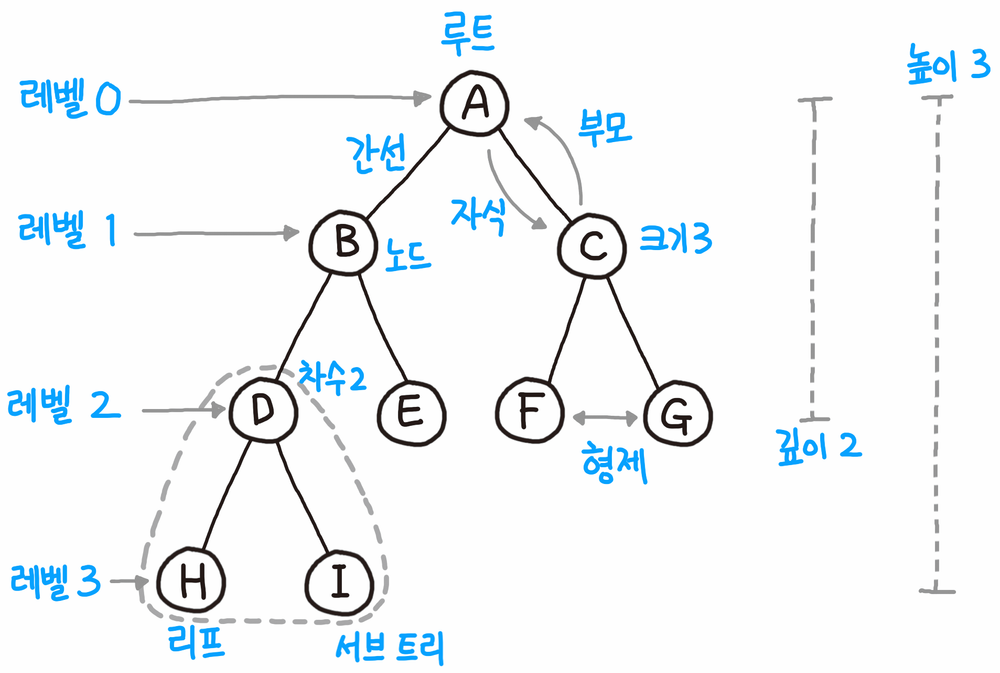
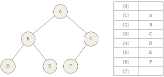

# 데이터 구조

> 작성자: 김주호

## 트리

>거꾸로 된 나무
>
>비선형 계층적 자료구조

## 트리 구조

> 계층이 있는 데이터들!

### 계층(깊이, depth)

- 루트에서 해당 노드까지의 간선(edge) 수
- 루트에서 얼마나 떨어져있는가

## 이진트리의 구현

> LinkedList를 활용하여 손쉽게 가능

| **값** | **Left** | **Right** |
| ------ | -------- | --------- |
| A      | B  ref   | C  ref    |
| B      | D  ref   | E  ref    |
| C      | F  ref   | G  ref    |
| D      | H  ref   | I  ref    |
| E      |          |           |
| F      |          |           |
| G      |          |           |
| H      |          |           |
| I      |          |           |

> ArrayList로는 index의 규칙성대로 접근하면 됨
>
> 루트노드를 1로 한다면, 맨 좌측 노드는 2, 4, 8, 16, ...의 2^n으로 성립됨
>
> 왼쪽 자식노드는 부모노드의 2배, 오른쪽 자식노드는 2배 + 1로 접근 가능

## 이진트리가 아니라면

- 노드가 가져야 할 값은 value, 부모노드의 주소, 자식노드의 주소들이다.
- 자식노드들은 몇 개일지 모르니 ArrayList 혹은 LinkedList로 지니고 있으면 된다.
  - 트리에서 접근이 자주 일어난다면 ArrayList, 첨삭이 자주 일어난다면 LinkedList

---

### Next: 계층 구조를 살려 정렬해보자

