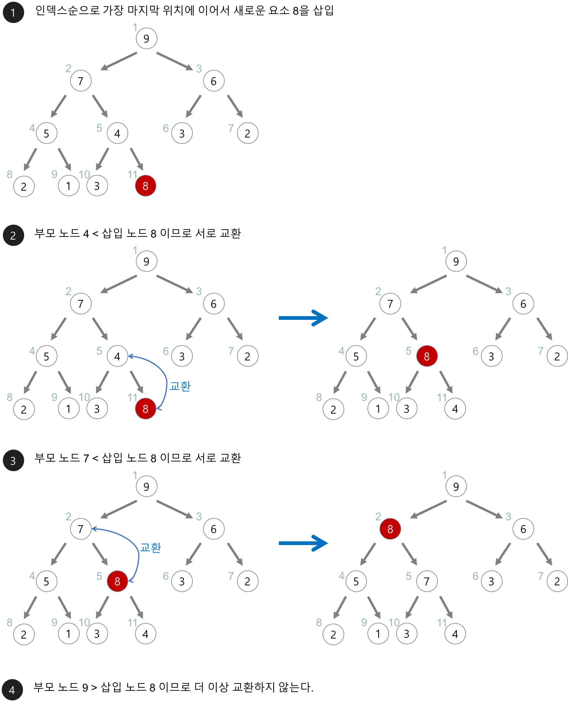
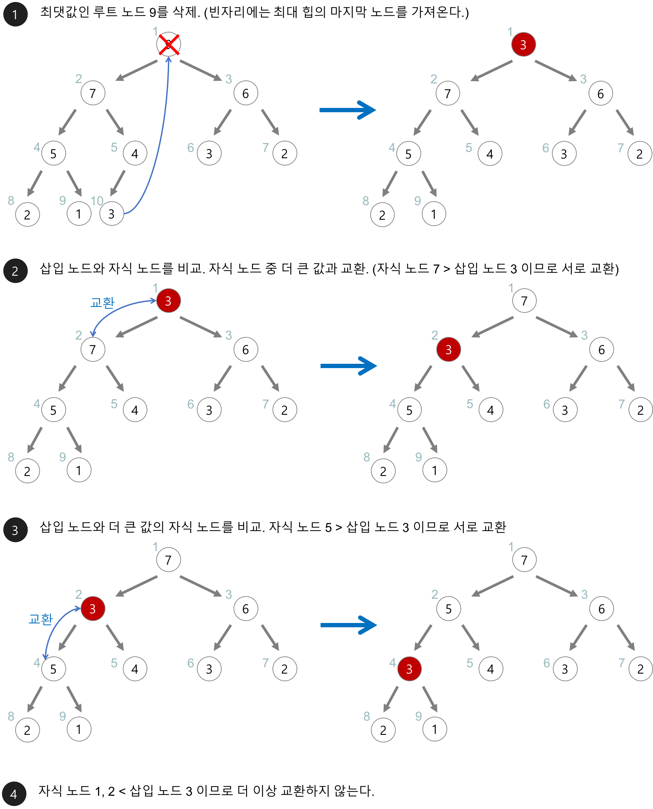

# 데이터 구조

> 작성자: 김주호

## 힙(heap)

>큐 + 트리
>
>완전 이진 트리 기반의 최소(혹은 최대) 힙 자료구조
>
>우선 순위 큐를 위해 만들어진 자료구조이다

## 정렬 큐?

> 반은 맞고, 반은 틀리다
>
> 가장 작은(혹은 가장 큰) 값을 큐의 맨 앞에 정렬!

## ArrayList? LinkedList?

> 둘 다 구현 가능하지만, 삭제되는 위치가 고정이며 값 비교를 통해 우선순위를 변동시키는 것이므로 ArrayList가 추천된다.

## 값이 추가될 때

## 값을 뺄 때(pop)

> 이미지 출처: [권희정님의 깃](https://gmlwjd9405.github.io/2018/05/10/data-structure-heap.html)

---

### Next: 균형 잡힌 트리에 대해 공부해보자

