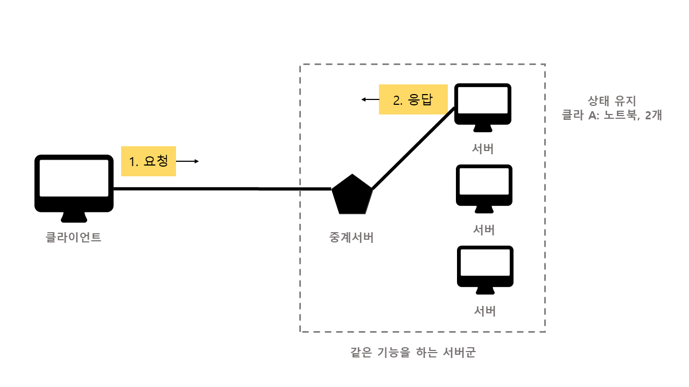
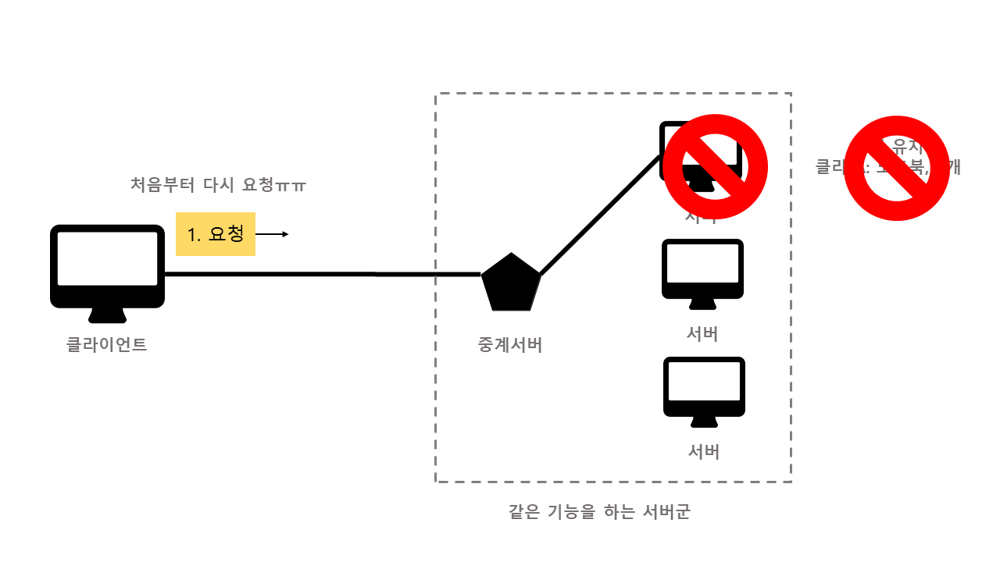
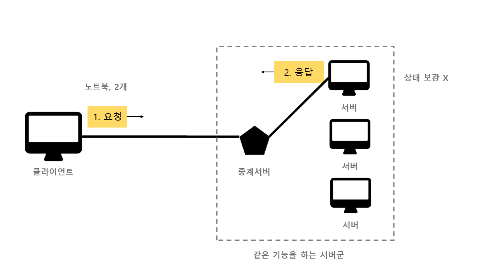
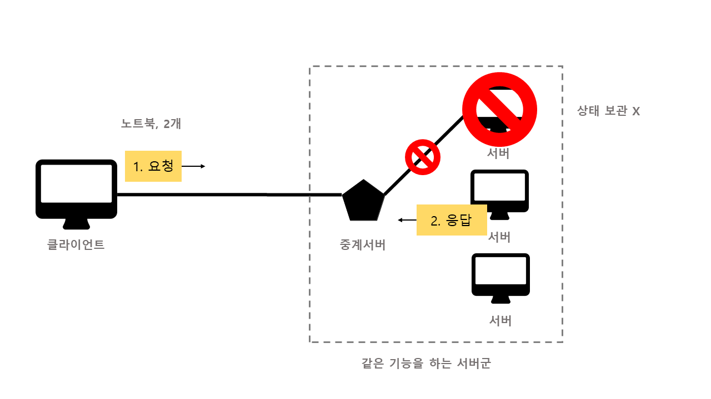
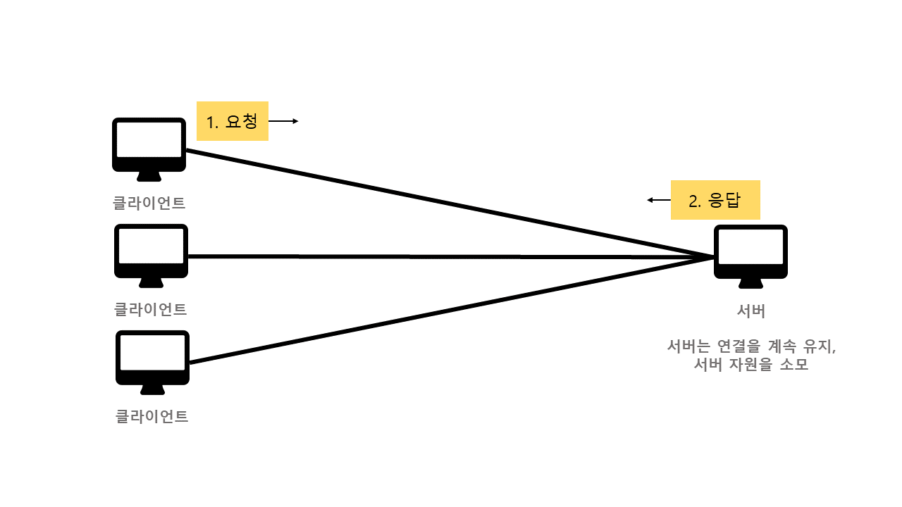
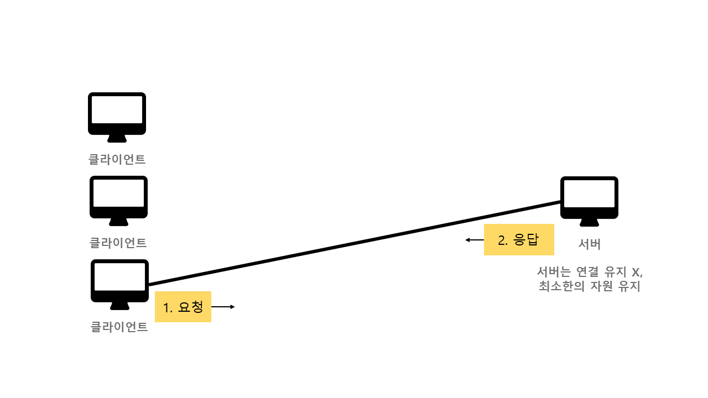
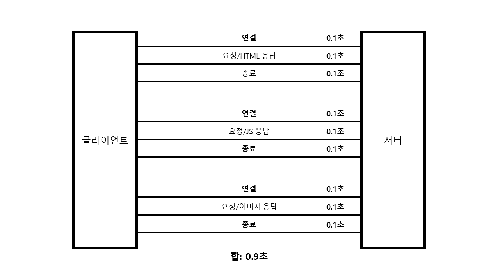
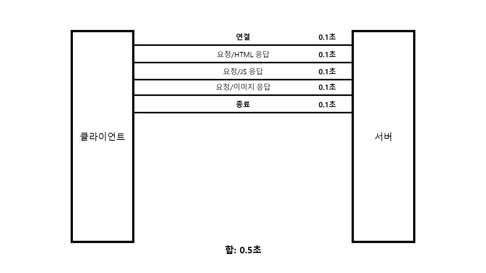
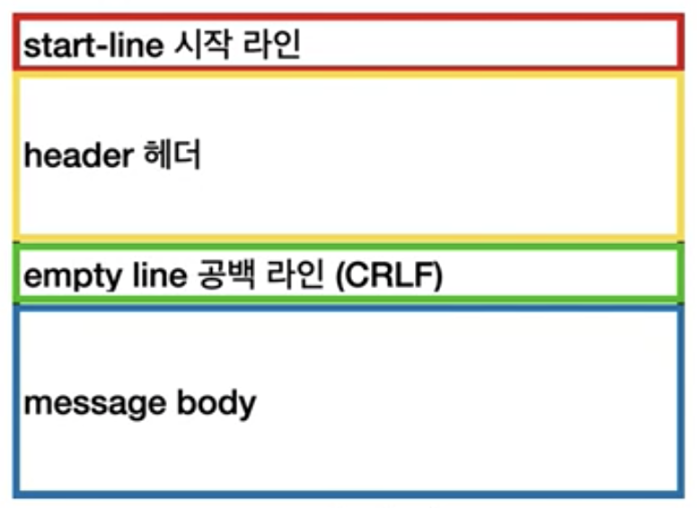
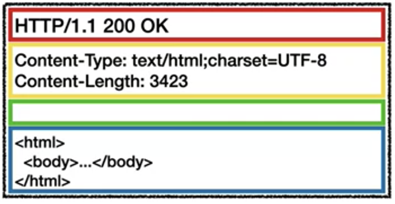

# HTTP

[TOC]

## HTTP 개요

### HTTP의 시작

HTTP는 **H**yper **T**ext **T**ransfer **P**rotocol의 약자입니다. HTTP는 하이퍼 텍스트를 전달하기 위한 프로토콜 즉, HTML을 전송하기 위한 프로토콜로 시작되었습니다.


### 이제는 모든 것이 HTTP

하지만 현재는 HTTP 메시지로 거의 모든 형태의 데이터 전송이 가능합니다. 아래 보이는 형식을 모두 전송할 수 있습니다.

- HTML, TEXT
- IMAGE, 음성, 영상, 파일
- JSON, XML(API)

요즘은 서버 간의 데이터를 주고 받을 때도 대부분 HTTP를 사용할 정도입니다. 지금은 HTTP 시대라고 해도 과언이 아닙니다. 


### HTTP의 역사

- HTTP/0.9 (1991): GET 메서드만 지원, HTTP 헤더 X
- HTTP/1.0 (1996): 메서드, 헤더 추가
- **HTTP/1.1 (1997): 가장 많이 사용, 우리에게 가장 중요한 버전**
  - RFC2068 (1997) => RFC2616 (1999) => RFC7230~7235 (2014)
  - 현재 인터넷 자료나 서적은 1999년에 나온 RFC2616 스펙을 설명한 것들이 많습니다.
  - RFC2616은 폐기되었으므로 최신 버전인 RFC 723X 버전을 알고 있는 것이 좋습니다. 관련 내용은 HTTP 헤더 부분에서 나올 예정입니다.
  - 1.1 버전에서 대부분의 기능이 구현되었고 2, 3 버전은 성능 개선에 초점이 맞추어져 있기 때문에 1.1을 이해하고 나면 추후에 2, 3을 이해하는 것은 어렵지 않습니다..
- HTTP/2 (2015): 성능 개선
- HTTP/3 (진행중): TCP 대신 UDP 사용, 성능 개선


### 기반 프로토콜

- TCP: HTTP/1.1, HTTP/2
- UDP: HTTP/3
- 현재 HTTP/1.1 주로 사용
  - HTTP/2, HTTP/3도 점점 증가


### HTTP 버전 확인

- 개발자 도구 > Network > 우클릭 > 프로토콜 클릭
- 다음과 같이 표시됩니다.
  - HTTP/1.1 => http/1.1
  - HTTP/2 => h2
  - HTTP/3 => h3

|                      프로토콜 확인 방법                      |
| :----------------------------------------------------------: |
|  |


## HTTP 특징

### 클라이언트 - 서버 구조

- 클라이언트는 서버에 요청을 보내고, 응답을 기다립니다.
- 서버는 요청에 대한 결과를 만들어서 응답합니다.
- 현재는 너무나 당연한 방법이지만, 클라이언트와 서버의 구분이 없던 때도 있었다고 합니다!


### 무상태 프로토콜(Stateless)

HTTP는 서버가 클라이언트의 상태를 보존하지 않기 때문에 무상태 프로토콜이라고 부릅니다. 무상태 프로토콜은 아래와 같은 장단점이 있는데 왜 이러한 장단점이 생기는지 알아보겠습니다.

- 장점: 서버의 확장성이 높습니다.(스케일 아웃)
- 단점: 클라이언트가 전송해야 할 데이터가 비교적 많습니다.


#### Stateful VS Stateless

우선 Stateful(상태 유지)와 Stateless(무상태)의 차이를 이해해야 합니다. 클라이언트 - 서버 간의 요청을 노트북을 구매하려는 고객(클라이언트)과 점원(서버)로 비유해보겠습니다.

먼저 **Stateful(상태 유지)한 방식**입니다.

| Stateful(상태 유지)                                          |
| :----------------------------------------------------------- |
| - 고객: 이 **노트북** 얼마인가요?<br />- 점원: 100만원입니다. **(노트북 상태 유지)**<br /><br />- 고객: **2개** 구매하겠습니다.<br />- 점원: 200만원입니다. **신용카드, 현금** 중에 어떤 걸로 구매하시겠어요? **(노트북, 2개 상태 유지)**<br /><br />- 고객: **신용카드**로 구매하겠습니다.<br />- 점원: 200만원 결제 완료되었습니다. **(노트북 2개, 신용카드 상태 유지)** |

2번째 대화에서, 고객은 **2개**를 구매하겠다고 말합니다. 무엇을 2개 사는지는 말하지 않았죠. 하지만 점원은 이전 대화(요청)에서 노트북 상태를 유지하고 있기 때문에 노트북 2개를 구매한다는 것을 알고 200만원이라는 결제 금액을 응답할 수 있습니다. **즉, 서버가 상태를 유지하는 것이죠.**

이렇게 보면 상태 유지 방식도 문제가 없어보입니다. **하지만 중간에 점원(서버)이 바뀐다면 어떻게 될까요?**

| Stateful(상태 유지) - 점원이 바뀐다면?                       |
| :----------------------------------------------------------- |
| - 고객: 이 **노트북** 얼마인가요?<br />- **점원 A**: 100만원입니다. **(노트북 상태 유지)**<br /><br />- 고객: **2개** 구매하겠습니다.<br />- **점원 B**: 어떤걸 2개 구매하시는거죠..? |

점원(서버) 측에서 상태 유지를 하고 있기 때문에 새로운 점원이 투입되면 고객은 처음부터 결제 과정을 반복해야 하는 문제가 발생합니다. 아니면 점원 A가 떠나기 전, 점원 B에게 상태를 넘겨주는 추가 작업이 필요하겠죠.

|        Stateful(상태 유지) - 클라이언트 서버 구조에서        |
| :----------------------------------------------------------: |
| <br /> |


그럼 **Stateless(무상태) 방식**을 살펴보겠습니다. 

| Stateless(무상태) - 점원이 바뀌어도 문제 없음!               |
| :----------------------------------------------------------- |
| - 고객: 이 **노트북** 얼마인가요?<br />- **점원A**: 100만원입니다.<br /><br />- 고객: **노트북 2개** 구매하겠습니다.<br />- **점원B**: 노트북 2개는 200만원입니다. **신용카드, 현금** 중에 어떤 걸로 구매하시겠어요?<br /><br />- 고객: **노트북 2개를 신용카드**로 구매하겠습니다.<br />- **점원C**: 200만원 결제 완료되었습니다. |

고객(클라이언트)이 정보를 모두 전달하기 때문에 중간에 다른 점원으로 바뀌어도 문제가 없습니다. 이러한 방법이라면 매장에 고객이 1000명이 몰리더라도 점원 수만 늘리면 걱정이 없습니다.

즉, 클라이언트 요청이 갑자기 증가해도 서버를 대거 투입할 수 있는 것이죠.

|        Stateful(상태 유지) - 클라이언트 서버 구조에서        |
| :----------------------------------------------------------: |
| <br /> |


### 비연결성(Connectless)

>  HTTP의 또다른 특징 중 하나는 비연결성(Connectless)입니다. 그림을 보면서 왜 연결을 유지하지 않도록 했는지 이해해봅시다.

연결을 유지하는 모델은 요청을 주고 받지 않는 상황에서도 연결을 유지합니다. 그만큼 서버 자원을 더 소모하게 되는 것이죠. 서버 자원은 한정되어 있으니 그만큼 처리할 수 있는 최대 요청 수가 줄어들게 됩니다.

|                     연결을 유지하는 모델                     |
| :----------------------------------------------------------: |
|  |

반면 연결을 유지하지 않는 모델은 요청-응답을 주고받으면 연결이 종료됩니다. 각 요청마다 최소한의 자원만 사용하는 것이죠.

요청과 응답은 일반적으로 초 단위 이하의 빠른 속도로 이루어집니다. 때문에 수천명이 이용하는 사이트라고 하더라도 같은 요청을 정확히 같은 시간에 보내는 수는 얼마 되지 않습니다.

연결을 유지하지 않음으로써 서버 자원을 훨씬 효율적으로 사용하고 더 많은 클라이언트의 요청을 처리할 수 있는 것입니다.

|                  연결을 유지하지 않는 모델                   |
| :----------------------------------------------------------: |
|  |

#### 비 연결성 정리

- HTTP는 기본적으로 연결을 유지하지 않습니다.
- 일반적으로 초 단위 이하의 빠른 속도로 응답합니다.
- 1시간 동안 수천명이 서비스를 사용해도 실제 서버에서 처리하는 요청은 수십개 이하로 적습니다.
- 서버 자원을 매우 효율적으로 사용할 수 있습니다.

#### 한계

- 매번 TCP/IP 연결을 새로 맺어야 합니다. (3 way handshake 시간 추가)
- 요청 시 HTML, JS, CSS, Image 등 수 많은 자원을 함께 다운로드 해야 합니다.

|                 HTTP 초기 - 연결, 종료 낭비                  |
| :----------------------------------------------------------: |
|  |

#### 극복

- 지금은 HTTP 지속 연결(Persistent Connections)로 문제 해결
- HTTP/2, HTTP/3에서는 연결 시간까지 최적화

|                        HTTP 지속 연결                        |
| :----------------------------------------------------------: |
|  |


### HTTP 메시지

HTTP 메시지는 다음과 같은 구조로 이루어져 있습니다.

|                       HTTP 메시지 구조                       |
| :----------------------------------------------------------: |
|  |

[공식 문서](https://datatracker.ietf.org/doc/html/rfc7230#section-3)에는 다음과 같이 나와 있습니다.

```
HTTP-message   = start-line
                 *( header-field CRLF )
                 CRLF
                 [ message-body ]
```

HTTP 메시지는 요청 메시지와 응답 메시지의 내용이 조금 다릅니다. 하지만 큰 구조는 동일하다는 것!

그리고 그림에는 나와있지 않지만 요청 메시지도 body 본문을 가질 수 있습니다.(ex. POST 요청)

|                         요청 메시지                          |                         응답 메시지                          |
| :----------------------------------------------------------: | :----------------------------------------------------------: |
|  |  |


#### 시작 라인(start-line)

##### 요청 메시지

> start-line = **request-line** / status-line

start-line은 request-line과 status-line 두 가지가 있습니다. 요청 메시지의 start-line은 request-line입니다 

```
request-line = method SP request-target SP HTTP-version CRLF
```

- `method` : HTTP 메서드(ex. GET)
- `request-target` : 요청 대상(ex. `/search?=hello&hi=ko`)
  - `absolute-path[?query]` (`절대경로[?쿼리]`)
  - 절대경로 = `/` 로 시작하는 경로
- `HTTP-version` : HTTP 버전(ex. `HTTP/1.1`)
- `SP` : 공백
- `CRLF` : 엔터

##### 응답 메시지

> start-line = request-line / **status-line**

응답 메시지의 start-line은 status-line입니다.

```
status-line = HTTP-verison SP status-code SP reason-phrase CRLF
```

- `HTTP-version` : HTTP 버전(ex. `HTTP/1.1`)
- `status-code` : 상태 코드
- `reason-pharse` : 사람이 이해할 수 있는 짧은 상태 코드 설명 글


#### 헤더(header)

HTTP 헤더에는 HTTP 전송에 필요한 모든 부가정보가 들어갑니다. 메시지 바디의 타입, 메시지 바디의 크기, 압축, 인증, 요청 클라이언트(브라우저 정보), 서버 애플리케이션 정보, 캐시 관리 정보 등등등..

메시지 바디에 들어가는 내용 외에 모든 메타데이터가 들어간다고 봐도 무방합니다. 그만큼 표준 헤더가 정말 정말 많습니다. [여기](https://en.wikipedia.org/wiki/List_of_HTTP_header_fields)에서 표준 헤더 목록을 볼 수 있습니다.

필요 시 임의의 헤더를 추가할 수도 있습니다. (ex. `helloworld: hihi`)

```
header-field = field-name ":" OWS field-value OWS
```

- `field-name` : 헤더 필드 이름, 대소문자 구분 없음 (ex. `Host`, `Content-Type`)
- `field-value` : 헤더 필드 값, 대소문자 구분 (ex. `www.google.com`)
- `OWS` : 띄어쓰기 허용


#### 메시지 바디

실제 전송할 데이터가 들어가있습니다. HTML 문서, 이미지, 영상, JSON 등등 byte로 표현할 수 있는 모든 데이터 전송이 가능합니다.
