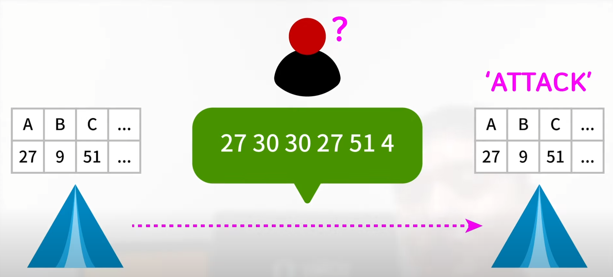
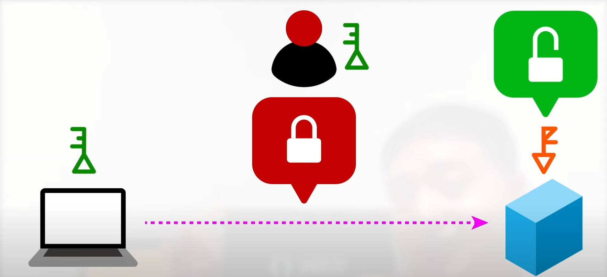
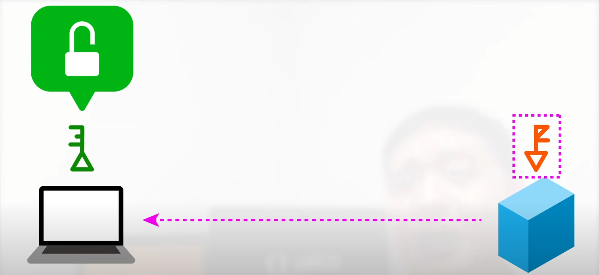
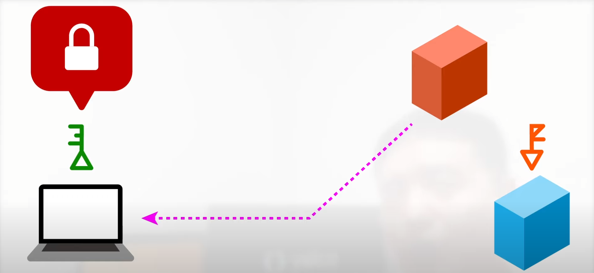

# HTTPS

[TOC]

## HTTPS란?

> **H**yper**T**ext **T**ransfer **P**rotocol over **S**ecure Socket Layer
>
> = HTTP over SSL
>
> = HTTP over TLS

HTTP의 보안이 강화된 버전으로 통신의 인증과 암호화를 위해 개발되었습니다.

일반 텍스트를 이용하는 대신 SSL이나 TLS 프로토콜을 통해 세션 데이터를 암호화합니다.

## SSL/TLS란?

> **T**ransport **L**ayer **S**ecurity(전송 계층 보안)
>
> = SSL(**S**ecure **S**ockets **L**ayer, 과거 명칭)

컴퓨터 네트워크에 통신 보안을 제공하기 위해 설계된 암호 규약입니다. 

SSL은 TCP/IP 암호화 통신에 사용되는 규약으로써 넷스케이프에서 만들었습니다.

SSL 3.0 버전부터는 [IETF(국제 인터넷 표준화 기구)](https://ko.wikipedia.org/wiki/%EA%B5%AD%EC%A0%9C_%EC%9D%B8%ED%84%B0%EB%84%B7_%ED%91%9C%EC%A4%80%ED%99%94_%EA%B8%B0%EA%B5%AC)에서 표준으로 정해서 TLS 1.0이 되었습니다.

하지만 아직도 SSL로 불리는 경우가 많습니다. 이 글에서도 편의상 SSL로 통일하여 지칭하겠습니다.

### 대칭키 암호화와 비대칭키 암호화

SSL에서는 데이터를 암호화해서 전송하는데, 여기에 사용되는 방식이 **대칭키 암호화**와 **비대칭키 암호화**입니다.

#### 대칭키 암호화(Symmetric Key)

대칭키 암호화는 **하나의 키**로 암호화와 복호화를 모두 하는 방식입니다.

따라서, 암호화된 정보를 전달하고 확인하기 위해서는 <u>송수신자 둘 다 똑같은 키를 가지고 있어야 합니다</u>.

이러한 <u>키를 안전하게 교환</u>하는 것이 대칭키 암호화 방식의 가장 중요한 부분입니다.

|                 대칭키 암호화(Symmetric Key)                 |
| :----------------------------------------------------------: |
|  |

#### 비대칭키 암호화(Asymmetric Key)

비대칭키 암호화는 **두 개의 키**로 암호화와 복호화를 하는 암호화 방식입니다.

하나는 <u>자신만 갖고 있는 개인키(Private Key)</u>라 부르고, 다른 하나는 <u>모두에게 공개하여 공개키(Public Key)</u>라고 부릅니다. 그래서 비대칭키 암호화는 공개키 암호화라고 부르기도 합니다.

<u>개인키로 암호화한 정보는 공개키로만 복호화 할 수 있고, 공개키로 암호화한 정보는 개인키로만 복호화 할 수 있습니다.</u> (개인키 암호화 => 개인키 복호화 X, 공개키 암호화 => 공개키 복호화 X)

##### 공개키 암호화 => 암호키 복호화

> 키 교환 없이 암호화

회원가입 정보를 네이버에 암호화하여 보낸다고 생각해봅시다. 공개키는 모두에게 공개되어 있기 때문에, 누구나 네이버 공개키로 암호화하여 정보를 전달할 수 있습니다.

하지만 <u>이 정보를 복호화 할 수 있는 것은 개인키를 가진 네이버 뿐</u>입니다. 공개키로 암호화된 정보는 공개키로 복호화가 불가능하기 때문에 다른 누군가가 열어보려 해도 열 수 없습니다.

키를 전달해야 하는 대칭키의 문제점이 해결되는 지점입니다.

|      공개키 암호화 => 암호키 복호화      |
| :--------------------------------------: |
|  |

##### 개인키 암호화 => 공개키 복호화

> 인증 역할 수행

우리가 네이버에 접속을 시도합니다. 그런데, 이 사이트가 피싱 사이트가 아닌 진짜 네이버 사이트인지 어떻게 알 수 있을까요?

네이버는 페이지 정보를 전달할 때 개인키로 암호화하여 정보를 전달합니다. 우리는 모두가 알 수 있는 네이버 공개키로 복호화를 진행하고 페이지 정보를 받아볼 수 있습니다. 만약 피싱 사이트의 개인키로 암호화된 정보를 받는다면 네이버 공개키로 복호화가 불가할 것입니다.

이 경우에는 <u>공개키로 누구나 정보를 복호화 할 수 있으므로 암호화의 목적보다 인증의 목적</u>이 강합니다.

|                개인키 암호화 => 암호키 복호화                |
| :----------------------------------------------------------: |
| 네이버 공개키로 복호화가 되면 네이버가 맞다!  |
| 네이버 공개키로 복호화가 안 되면 네이버가 아니다!  |

### SSL 작동방식

실제 주고받을 데이터는 대칭키로 암호화하여 주고받습니다. 비대칭키 암호화에 비해 속도가 빠르기 때문입니다.

하지만 키를 주고받아야 한다는 문제점이 있었습니다. 어떻게 안전하게 대칭키를 주고받을 수 있을까요?

이 대칭키를 주고받는 과정에서 인증기관(CA)과 비대칭키 암호화가 등장합니다.

#### 인증기관(Certification Authority, CA)

우선 내가 접속하는 사이트가 신뢰할 수 있는지 알 필요가 있습니다. HTTPS 통신에서는 이를 보장하는 제 3자 인증을 사용합니다.

인증기관으로부터 인증서를 발급받은 사이트만 경고 없이 HTTPS 통신을 할 수 있도록 하는 것이죠. 인증서는 아래와 같은 과정을 통해 발급됩니다.

---

1. 네이버는 HTTPS로 웹서비스를 제공하기로 했습니다.
2. 네이버는 네이버 공개키와 네이버 개인키를 생성합니다.
3. 네이버 공개키는 인증기관에 보냅니다.
4. 인증기관에서는 네이버 공개키, 유효기간, 도메인 등의 정보를 포함하여 인증기관 개인키로 전자서명(= 인증 목적)한 인증서를 만들고 네이버에 발급합니다.

---

인증서는 다음과 같은 특징이 있습니다.

- 인증기관 개인키로 서명되었다.
  - 인증기관 공개키로 복호화하면 인증 완료 가능하다.
- 네이버 공개키가 들어있다.

#### 대칭키 생성 및 교환

이번에도 네이버를 예로 들어보겠습니다.

---

- 모든 웹 브라우저는 여러 인증기관의 공개키를 갖고 있습니다.
- 브라우저가 네이버에 요청을 보내면, 네이버는 인증서를 보냅니다.
- 브라우저는 인증기관 공개키로 인증서를 복호화합니다.
  - 네이버가 신뢰할 수 있다는 인증이 완료됩니다.
  - 네이버 공개키를 얻습니다.
- 대칭키를 생성합니다.
- 대칭키를 네이버 공개키로 암호화합니다.
- 암호화된 대칭키를 네이버에 보냅니다.
- 네이버는 네이버 개인키로 복호화합니다.
- 대칭키 교환이 안전하게 완료되었습니다.
- 대칭키를 사용하여 필요한 데이터를 주고받습니다.

#### 정리

- 실제 데이터 교환에는 대칭키를 사용합니다.
- 사이트 인증, 대칭키 교환 과정에서 비대칭키를 사용합니다.

# Reference

[HTTPS가 뭐고 왜 쓰나요?(Feat. 대칭키 vs 비대칭키)](https://youtu.be/H6lpFRpyl14)

[SSL 동작 방식을 간단히 알아보기](https://offbyone.tistory.com/274)

[무조건 이해 시켜드립니다. 대칭키와 비대칭키에 대하여](https://universitytomorrow.com/22)