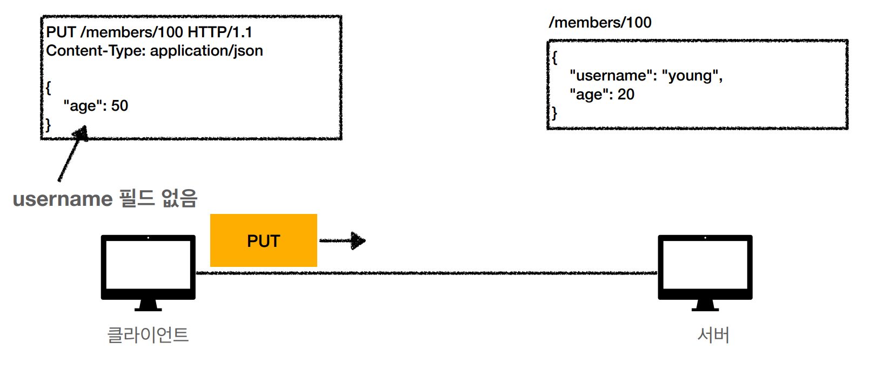
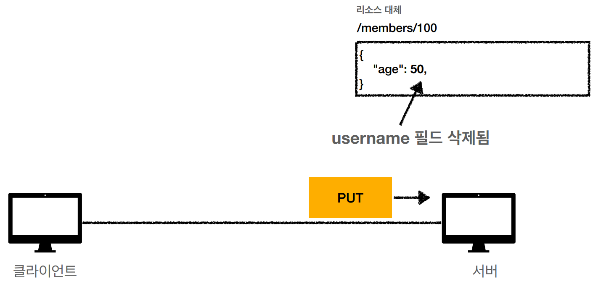
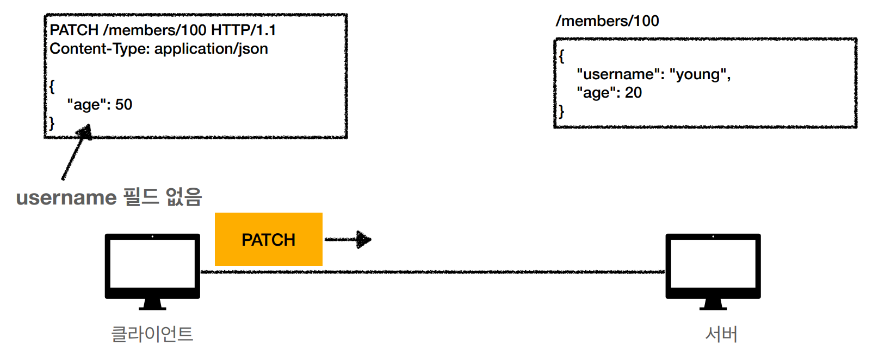
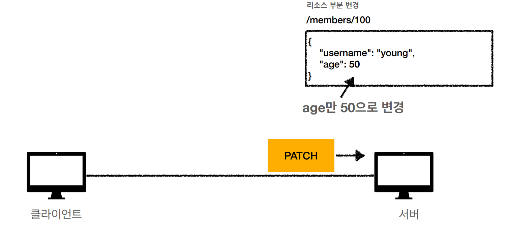
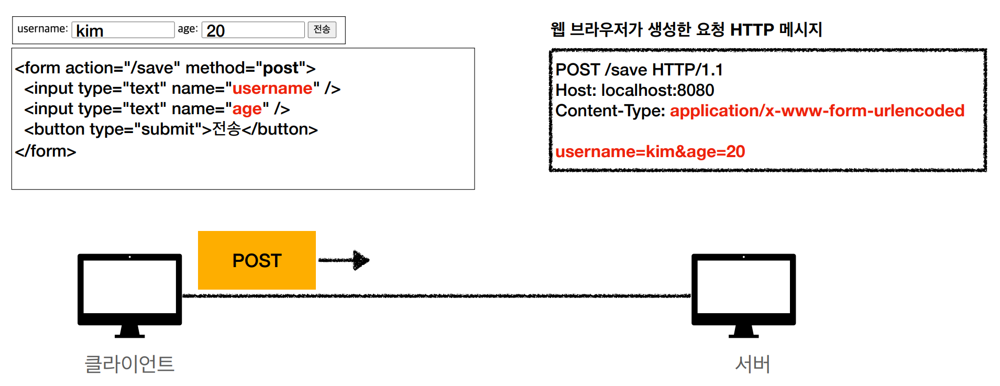
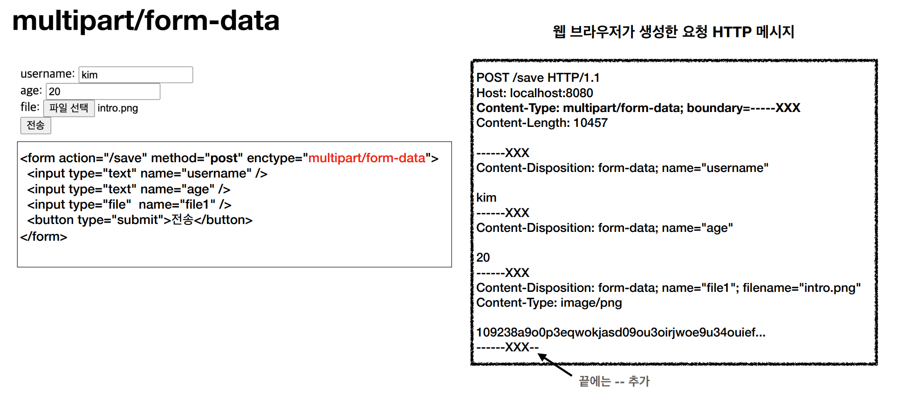
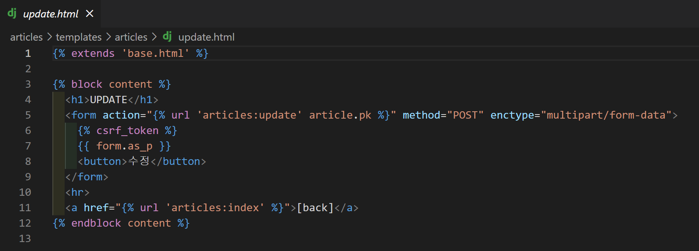
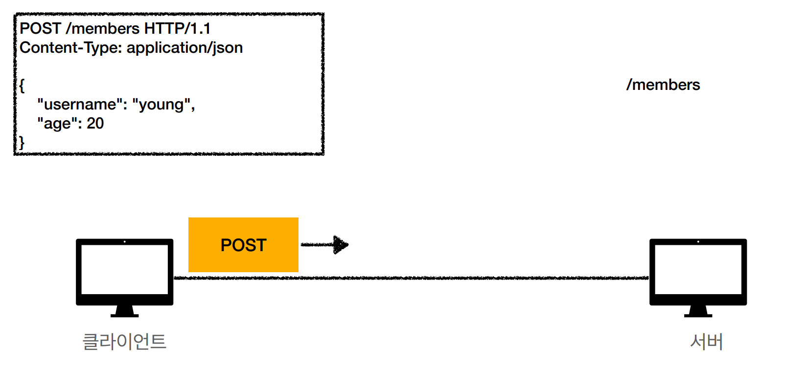

# HTTP 메서드

[TOC]

## HTTP 메서드의 종류


### 주요 메서드

- GET: 리소스 조회
- POST: 요청 데이터 처리, 주로 등록에 사용
- PUT: 리소스를 대체, 해당 리소스가 없으면 생성
- PATCH: 리소스 부분 변경
- DELETE: 리소스 삭제

### 기타 메서드

- HEAD: GET과 동일하지만 메시지 부분을 제외하고 상태 줄과 헤더만 반환
- OPTIONS: 대상 리로스에 대한 통신 가능 옵션(메서드)을 설명 (주로 CORS에서 사용)
- CONNECT: 대상 자원으로 식별되는 서버에 대한 터널을 설정
- TRACE: 대상 리소스에 대한 경로를 따라 메시지 루프백 테스트를 수행


### GET

- 리소스 조회
- 서버에 전달하고 싶은 데이터는 query(쿼리 파라미터, 쿼리 스트링)를 통해서 전달
- 메시지 바디를 사용해서 데이터 전달 가능
  - 하지만 지원하지 않는 서버들이 많아 권장 X, 실무에서도 이런 방식은 사용 X

### POST

- 메시지 바디를 통해 서버로 요청 데이터 전달
- 서버는 요청 데이터를 처리
  - 메시지 바디를 통해 들어온 데이터를 처리하는 모든 기능을 수행한다.
- 주로 전달된 데이터로 신규 리소스 등록, 프로세스 처리에 사용

#### 언제 쓸까

> **POST는 데이터 등록만? NO!!**

1. 새 리소스 생성(등록)
   - 서버가 아직 식별하지 않은 새 리소스 생성 (글 작성, 신규 주문 생성 등)
2. 요청 데이터 처리
   - 단순히 데이터 생성, 변경을 넘어 프로세스를 처리해야 하는 경우
   - ex) 결제완료 => 배달시작 => 배달완료 처럼 단순히 값 변경을 넘어 프로세스의 상태가 변경되는 경우
   - POST의 결과로 새로운 리소스가 생성되지 않을 수도 있음
3. 다른 메서드로 처리하기 애매한 경우
   - JSON으로 조회 데이터를 넘겨야 하는데, GET 메서드를 사용하기 어려운 경우
   - 애매하면 POST

### PUT

- **리소스를 대체**
  - 리소스가 있으면 대체
  - 리소스가 없으면 생성
  - == 덮어쓰기
- **클라이언트가 리소스를 식별**
  - 클라이언트가 리소스 위치를 알고 URI 지정
  - POST와 차이점

|              PUT은 덮어쓰기!               |
| :----------------------------------------: |
|  |
|  |

### PATCH

- 리소스 부분 변경
- 요즘은 대부분 서버가 지원하지만 간혹 PATCH를 지원하지 않는 서버도 있다.
  - 이 경우는 POST 사용..!

|               PATCH는 부분변경               |
| :------------------------------------------: |
|  |
|  |

### DELETE

- 리소스 제거


## HTTP 메서드의 속성


### 안전(Safe Methods)

- 호출해도 리소스를 변경하지 않는다.
- GET, HEAD, OPTIONS, TRACE

---

Q. 호출을 어마어마하게 많이 해서 로그가 엄청 쌓이는 문제로 장애가 발생하면요?

A. 안전은 해당 리소스만 고려한다. 그런 부분까지는 고려 X

---

### 멱등(Idmpotent Methods)

- f(f(x)) = f(x)
- 한 번 호출하든 두 번 호출하든 100번 호출하든 결과가 같다!
- 멱등 메서드
  - GET: 한 번 조회하든, 두 번 조회하든, 같은 결과가 조회된다.
  - PUT: 결과를 대체한다. 따라서 같은 요청을 여러 번 해도 최종 결과는 같다.
  - DELETE: 결과를 삭제한다. 같은 요청을 여러 번 해도 삭제된 결과는 똑같다.
- 멱등이 아닌 메서드
  - **POST: 두 번 호출하면 같은 결제가 중복해서 발생할 수 있다.**

#### 멱등 어디에 써먹지?

- 자동 복구 매커니즘
- 서버가 TIMEOUT 등으로 정상 응답을 못 주었을 때, 클라이언트가 같은 요청을 다시 해도 되는지 판단 근거
  - ex) 삭제 요청을 보냈는데, 서버가 처리에 성공했는지 실패했는지 알 수 없다. 클라이언트가 같은 요청을 다시 해도 될까?
  - DELETE는 멱등이기 때문에 가능!

---

Q. 재요청 중간에 다른 곳에서 리소스를 변경해버리면?

- 사용자1: GET -> `username:A, age:20`
- 사용자2: PUT -> `username:A, age:30`
- 사용자1: GET -> `username:A, age:30` -> 사용자 2의 영향으로 바뀐 데이터 조회

A: 멱등은 외부 요인으로 리소스가 변경되는 것 까지는 고려하지 않는다.

---

### 캐시 가능(Cacheable Methods)

- 응답 결과 리소스를 캐시해서 사용해도 되는가?
- GET, HEAD, POST, PATCH 캐시 가능
- 실제로는 GET, HEAD 정도만 캐시로 사용
  - POST, PATCH는 본문 내용까지 캐시 키로 고려해야 하는데, 구현이 쉽지 않음


## HTTP 메서드의 활용

### HTML Form을 통한 데이터 전송

- **GET, POST만 지원**

#### Content-Type: application/x-www-form-urlencoded

- form의 내용을 메시지 바디를 통해서 전송(key=value, 쿼리 파라미터와 같은 형식)
- 전송 데이터를 url encoding 처리
  - ex) abc김 => abc%EA%b9%80

|                    HTML Form - POST 요청                     |
| :----------------------------------------------------------: |
|  |

#### Content-Type: mulitpart/form-data

- 파일 업로드 같은 바이너리 데이터 전송 시 사용
- 다른 종류의 여러 파일과 폼의 내요 함께 전송 가능(그래서 이름이 multipart)

|                    HTML Form - 파일 전송                     |
| :----------------------------------------------------------: |
|  |

#### Django 예제

- 게시물 Update Form
- HTML Form은 GET, POST 메서드만 사용 가능하기 때문에 PUT 메서드가 아닌 POST 메서드 사용
- 파일 전송을 위해 `enctype="multipart/form-data"` HTML attribute를 작성 => Content-Type 헤더를 multipart/form-data로 설정

|                     Django template 예시                     |
| :----------------------------------------------------------: |
|  |


### HTTP API를 통한 데이터 전송

- 서버 to 서버(백엔드 시스템 통신)
- 앱 클라이언트(아이폰, 안드로이드)
- 웹 클라이언트
  - HTML에서 Form 전송 대신 자바스크립트를 통한 통신에 사용(AJAX)
  - 예) React, Vue.js 같은 웹 클라이언트와 API 통신
- POST, PUT, PATCH 등의 메서드를 사용해 메시지 바디에 데이터를 담아 전송
- GET: 조회 시 사용, 필요한 데이터는 쿼리 파라미터 사용
- Content-Type: application/json을 주로 사용 (사실상 표준)
  - TEXT, XML, JSON 등등

|                           HTTP API                           |
| :----------------------------------------------------------: |
|  |

#### AJAX로 파일을 전달해야 한다면?

> [FormData](https://2ham-s.tistory.com/307) 사용

1. `new FormData()` 로 FormData 객체를 생성
2. 전달할 내용, 파일을 FormData 객체에 담기
3. 제출 버튼 클릭 시 발생하는 submit 이벤트를 `preventDefault`로 멈추고 데이터 전송
   1. **FormData 역시 HTML Form처럼 GET, POST 메서드만 사용 가능**
   2. 데이터 전송 시 Content-Type: multipart/form-data 설정


##### Vue.js 프로필 업데이트 메서드 예제(이미지 변경 포함)

```javascript
// 업데이트 요청
    updateUser: function () {
      // 이미지 formdata에 담기
      const userData = new FormData()
      // 이름을 django 모델의 필드명과 동일하게 맞춰줘야 함
      if (this.selectedImage) {
        userData.append('profile_image', this.selectedImage, this.selectedImage.name)
      }
      userData.append('username', this.inputUsername)
      userData.append('email', this.dataSet.email)
      userData.append('name', this.dataSet.name)
      userData.append('is_private', this.dataSet.isPrivate)
      // api 요청
      axios({
        // FormData 역시 get, post 메서드만 사용 가능
        method: 'post',
        url: `${process.env.VUE_APP_SERVER_URL}/accounts/update/${this.username}/`,
        data: userData,
        headers: {
          ...this.setToken(),
          'Content-Type': 'multipart/form-data'
        }
      })
        .then(() => {
          const updateModalCloseBtn = document.querySelector('#updateModalCloseBtn')
          updateModalCloseBtn.click()
          this.login()
        })
        .catch(err => {
          console.log(err)
        })
    },
```

