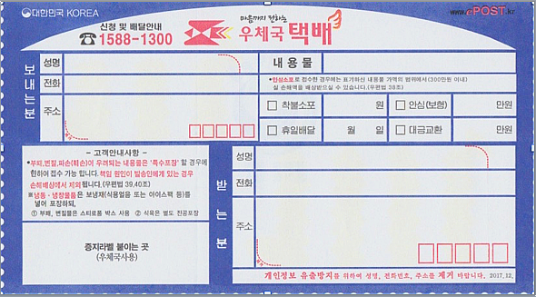
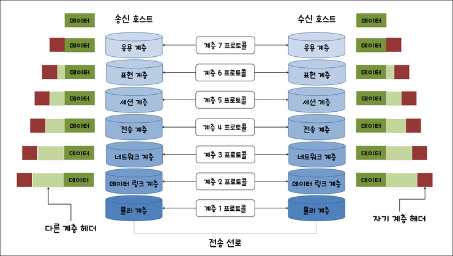
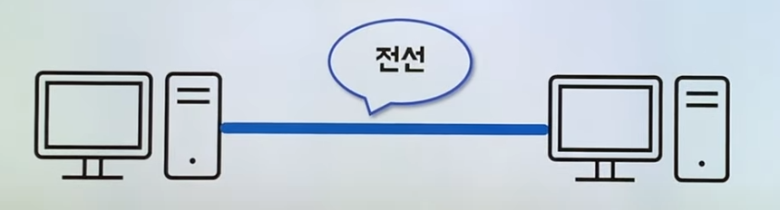
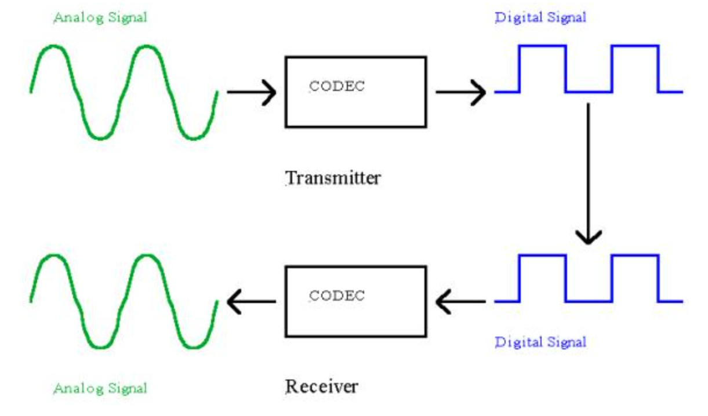
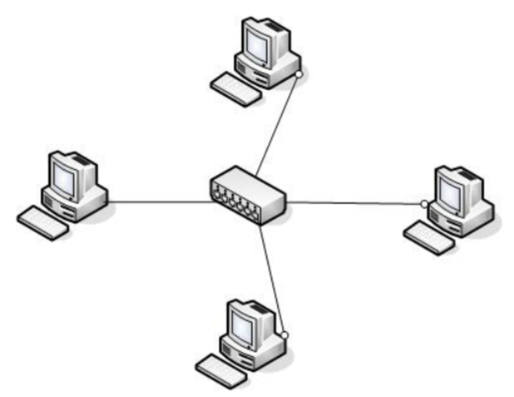

# OSI 7 계층

> 작성자: 유현수

## 기본 개념

### OSI 7 계층이란

#### 이름부터 살펴보자.

> Open Systems Interconnection Reference Model

- 상호 연결을 위한 개방형 기초 참조 모델
  - 상호 연결을 위한: 네트워크 통신을 하기 위한
  - 개방형: 누구나 쓸 수 있는
  - 기초 참조 모델: 참조해서 사용하면 되는 모델

#### 이 녀석은 왜 이런 이름을 갖고 탄생했을까?

- 표준이 필요했기 때문!
  - 네트워크 통신 규격의 표준이 없을 때는 통신 장비를 만드는 회사마다 통신 규격이 달라 호환이 안 됐다고 한다.
  - 이를 해결하기 위해 **누구나(개방형) 참조해서 쓸 수 있는(참조)** 네트워크 규격이 탄생!

#### 7 계층으로 왜 나눴을까?

- 통신이 일어나는 과정을 단계별로 알 수 있다.
- 특정한 곳에 이상이 생기면 해당 단계만 수정할 수 있다. => 유지보수 편의 증대!

### OSI 7 계층의 특징

- 상하 구조: 상위 계층의 프로토콜이 동작하기 위해서는 하위의 모든 계층에 문제가 없어야 한다.
- 문제 해결의 편의: 상하구조라는 특징 덕분에 각 계층의 동작을 확인해보면 문제가 생긴 계층을 찾아낼 수 있다.

## 세부 개념

### OSI 7 계층의 구조

프로토콜이란?

  - 컴퓨터나 원거리 통신 장비 사이에서 메시지를 주고 받는 양식과 규칙의 체계. 

  - 메시지가 택배라면, **프로토콜은 택배 송장**이다.

  - 택배를 잘 보내기 위해 정한 약속이 곧 송장(≒ 프로토콜)

    

- 신호 체계, 인증, 그리고 오류 감지 및 수정기능을 포함할 수 있다.

### 7. 응용 계층(Application Layer)

- OSI 7계층 중 최상위 계층이며, **사용자가 직접 눈으로 보고 실제 작업을 하는 계층**이다. 웹 브라우저, HTTP 등 사용자와 직접적으로 상호작용하는 모든 응용 프로그램들이 속한다.

### 6. 표현 계층(Presetation Layer)

- 표현 계층은 **데이터의 Format(형식)을 정의**한다. 일반적으로 응용 프로그램 형식과 네트워크 형식 간의 변환을 수행한다. 즉, 서로 다른 환경의 컴퓨터와 Application들이 데이터를 서로 이해할 수 있도록 도와주는 계층이다.

- JPEG, GIF(그래픽 포맷) / MPEG, QUICKTIME(동영상 포맷) / MIDI(음악 포맷) / ASCII, EBCDIC(텍스트 포맷) 등을 지정한다.

- **데이터의 압축, 암호화 기능**도 수행한다.

### 5. 세션 계층(Session Layer)

- 2개의 기기, 컴퓨터 또는 서버 간의 통신을 위해서는 **세션(Session)**을 만들어야 하는데 이 작업이 여기서 처리된다. 네트워크 연결을 설립(Establishment), 제어와 운영(Manage and Control), 연결의 종료(Terminate)를 책임진다. 

- 데이터 송신 시, 효율적인 세션 관리를 위해 표현 계층으로부터 받은 데이터를 짧은 단위로 나눈 후 전송 계층으로 내려 보낸다.

- OS(Operating Systems)가 이 계층에 속한다.

### 4. 전송 계층(Transport Layer)

- 전송 계층은 양 끝단(End to end)의 사용자들이 신뢰성 있는 데이터를 주고 받을 수 있도록 해 주어, 상위 계층들이 데이터 전달의 유효성이나 효율성을 생각하지 않도록 해준다.
- 가장 잘 알려진 전송 계층의 예는 TCP, UDP 등이 있다.

### 3. 네트워크 계층(Network Layer)

- 네트워크 계층의 가장 중요한 일은 패킷을 목적지까지 가장 빠른 길로 전송하는 역할이다. 이 계층에서는 에러가 생기든 말든 일단 보내는 것에 집중한다. 에러가 나면 상위 계층에서 해결해주기 때문에 에러에 신경쓰지 않는다.

### 2. 데이터 링크 계층(Data Link Layer)

- 데이터 링크 계층은 포인트 투 포인트(Point to point) 간 신뢰성있는 전송을 보장하기 위한 계층이다.
- 주소 값은 물리적으로 할당 받는데, 이는 네트워크 카드(랜카드)가 만들어질 때부터 할당된 맥 주소(MAC Address)를 사용한다.
- 네트워크 위 개체들 간 데이터를 전달하고, 물리 계층에서 발생할 수 있는 오류를 찾아내고, 수정하는데 필요한 수단을 제공한다.

### 1. 물리 계층(Physical Layer)

#### 두 대의 컴퓨터가 통신하려면?

- 모든 파일, 프로그램은 0과 1의 나열이다.
- 결국 0과 1을 주고받을 수 있으면 된다!
- 즉, 아래처럼 두 대의 컴퓨터를 전선으로 연결하여 0과 1을 주고받게 하면 된다!

- 전선을 통해 전달된 아날로그 신호를 컴퓨터가 이해할 수 있는 디지털 신호(이진수)로 변환해주는 장치가 바로 물리 계층에 해당하는 장치들!

#### 근데 이게 실제로는 쉽지가 않다..

- 바람, 번개같은 외부 자극이나 다른 통신의 간섭으로 신호가 왜곡될 수도 있고, 지연이 생길 수도 있고, 감쇠도 있고... 온갖 난리가 날 수 있다.
- 이걸 온갖 방법으로 동기화 해주고, 이런저런 어려운 방법으로 해내는게 물리적 계층!

#### 구체적으로 어떤 장비들이 해당될까?

- 통신 케이블(랜선의 구리선, 광섬유 등)

- 리피터: 장거리 통신이 가능하게 해주는 장치

- 허브

  - 다수의 PC 혹은 장치들을 묶어서 네트워크를 만들어준다.

  

## 참고자료

- [OSI 7 계층 모델 완벽 이해](https://jhnyang.tistory.com/194)

- [히히의 OSI 7 layer](https://youtu.be/1pfTxp25MA8)

