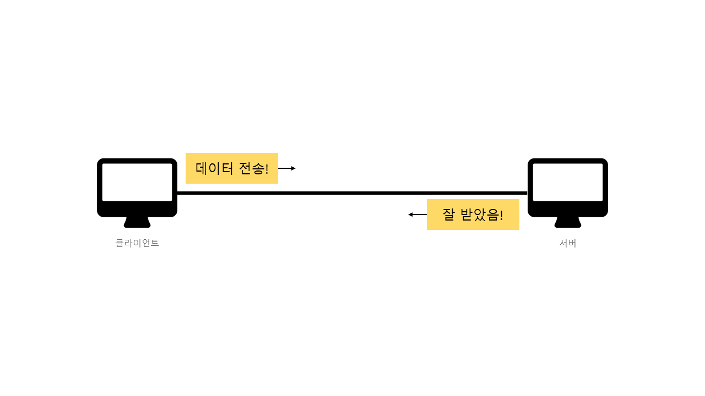
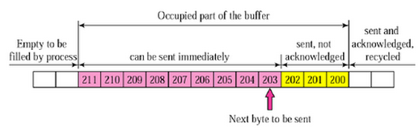
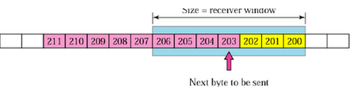

# TCP/IP

> TCP, IP는 컴퓨터들이 인터넷을 통해 정보를 주고받는 과정에서 사용하는 통신 규약(프로토콜)입니다.
> 인터넷 프로토콜 중 가장 많이 쓰이는 만큼 중요하고, 신입 개발자 면접의 단골 소재로 등장하기도 하니, 잘 짚고 넘어가는 것이 좋습니다.
>
> 그런데 처음 TCP, IP를 접하면 프로토콜이 뭔지, 통신 규약은 왜 필요한지부터 이해가 되지 않습니다. 그래서 다음과 같은 흐름으로 TCP/IP를 설명할 예정입니다.
>
>
> 1. 인터넷 통신은 어떻게 이루어질까(+ IP는 왜 필요할까)
> 2. IP는 뭘까
> 3. TCP는 왜 필요할까
> 4. TCP는 뭘까
> 4. TCP/IP 4 Layer
> 4. TCP 심화

## 인터넷 통신은 어떻게 이루어질까

### 초미니 인터넷

내 방 안에 컴퓨터 두 대가 있다고 생각해봅시다. 하나는 클라이언트, 하나는 서버 역할을 합니다. 그리고 아래 과정을 거치면 초미니 인터넷이 완성됩니다.

1. 두 컴퓨터를 전선으로 잇는다.
2. 클라이언트에서 Hello, world!를 전송한다.
3. 서버에서 잘 받았다는 응답 OK를 전송한다.

|                     초미니 인터넷                     |
| :---------------------------------------------------: |
|  |

### IP는 왜 필요할까

하지만 실제 인터넷은 두 대로만 이루어있지 않습니다. 전 세계의 컴퓨터 뿐 아니라 이들의 중간 다리 역할을 하는 온갖 서버들, 라우터들이 연결되어 있죠.

여기서 문제가 발생합니다. 내가 데이터를 보낼 컴퓨터(서버)를 어떻게 찾아갈까요? 편지를 보내려는데, 받을 사람의 주소를 모르는 것과 같은 상황입니다. 

|                   현실의 인터넷은..                    |
| :----------------------------------------------------: |
|  |

## IP(Internet Protocol)는 뭘까

### IP의 등장

이 문제를 해결하기 위해 사람들은 컴퓨터에 주소를 부여하기로 **약속**합니다. 주소를 알고 있으니, 원하는 컴퓨터와 데이터를 주고받을 수 있습니다.

IP(Internet Protocol)의 등장입니다.

### Internet Protocol이란?

프로토콜은 **데이터를 교환할 때, 지켜야 할 약속** 정도로 이해할 수 있습니다. 편지에 비유하면 더욱 이해하기 쉽습니다. 우리는 편지를 보내기 위해 다음과 같은 약속을 지켜야 합니다.

1. 편지는 편지 봉투에 담아서 보낸다.
2. 편지 봉투에는 보내는 사람과 받는 사람의 주소를 도로명 주소로 작성한다.

데이터를 교환하기 위해서는 다음과 같은, IP라는 약속을 지켜야 합니다.

- 데이터는 **패킷에 담아서 보낸다.**
- **패킷에는 출발지 IP와 도착지 IP를 기록**한다.

편지봉투에 주소를 적기로 약속했기 때문에 편지를 보낼 수 있듯이, 패킷에 IP 주소를 적기로 약속했기 때문에 데이터를 보낼 수 있게 된 것입니다.

|                   IP 주소로 찾아가자                   |
| :----------------------------------------------------: |
|  |

### 패킷이란?

패킷은 통신 단위입니다. 전달할 데이터가 커지면, 여러 패킷에 나누어 담아 전달하기도 합니다.

다소 생소한 용어여서 무슨 의미가 있나 싶지만, 단순히 Package(수화물)와 Bucket(바구니)의 합성어입니다. '데이터를 담는 것' 정도의 의미를 주기 위해 대충 지은 이름이니 어렵게 생각하지 않아도 좋습니다.

### IP 패킷 정보

패킷에는 출발지 IP, 목적지 IP 정보가 기록됩니다. 전송하고자 하는 데이터가 패킷이라는 캡슐에 담겨 보내지는 것이죠.

|                      IP 패킷 정보                      |
| :----------------------------------------------------: |
|  |

### 클라이언트-서버 패킷 전달 과정

이제 데이터의 전달 과정을 보다 구체적으로 그려볼 수 있게 되었습니다.

1. 클라이언트는 출발지 IP, 목적지 IP가 기록된 패킷에 전송할 데이터(Hello, world!)를 담아 전송합니다.
2. 패킷에 기록된 목적지 IP로 패킷이 전달됩니다.

|                  클라이언트 패킷 전달                  |
| :----------------------------------------------------: |
|  |

서버측의 응답도 같은 방식으로 진행됩니다.

|                     서버 패킷 전달                     |
| :----------------------------------------------------: |
|  |

## TCP는 왜 필요할까(IP의 한계)

하지만 IP라는 약속이 생겨난 이후에도 발생하는 문제들이 있었습니다. 아래와 같은 문제들을 해결하기 위해 TCP가 등장하게 됩니다.

- 비연결성
- 비신뢰성
- 프로그램 구분

#### 비연결성

IP만으로는 목적지 컴퓨터가 패킷을 받을 수 있는 상태인지 확인할 수 없습니다. 그래서 목적지 컴퓨터가 꺼져있거나, 데이터 처리를 할 수 없는 상황에서도 일단 패킷을 보내버립니다.

편지를 받을 사람이 없는 빈 집에 편지를 보내는 것과 같은 문제가 발생하는 것입니다.

|                        비연결성                        |
| :----------------------------------------------------: |
|  |

#### 비신뢰성

- 패킷 소실

  - 패킷은 거대한 인터넷 망을 거쳐 전달되는 만큼, 중간의 서버가 꺼지거나 물리적인 광케이블이 끊어지는 등 수많은 방해요소를 만날 수 있습니다. 최악의 경우에는 패킷이 소실될 수도 있습니다. 하지만 IP만으로는 중간에 패킷이 소실되더라도 알 수 있는 방법이 없습니다.

  |                       패킷 소실                        |
  | :----------------------------------------------------: |
  |  |

- 패킷 전달 순서 문제

  - 데이터가 일정 크기 이상으로 커지면, 데이터를 여러 개의 패킷에 나누어 보내게됩니다. 그런데, 시시각각 변하는 인터넷 상황에 따라 각 패킷은 다른 경로로 보내지기도 합니다. 이 과정에서 패킷 순서가 바뀌어 전달되기도 하는데, IP만으로는 이를 알 수 있는 방법이 없습니다.

  |                  패킷 전달 순서 문제                   |
  | :----------------------------------------------------: |
  |  |

#### 프로그램 구분

리그 오브 레전드에는 음성 채팅 기능이 내장되어 있습니다. 음성 채팅을 하면서 게임을 한다고 생각해봅시다.

내 컴퓨터는 리그 오브 레전드 서버로부터 두 가지 데이터를 받아옵니다. 하나는 게임 데이터이고 다른 하나는 음성 채팅 데이터입니다. 그런데, 같은 서버에서 전달되는 서로 다른 두 데이터를 어떻게 구분할 수 있을까요? IP 주소만으로는 구분할 방법이 없습니다.

- 비연결성
- 비신뢰성
- 프로그램 구분

이 세 가지 문제를 해결하기 위해 TCP라는 새로운 약속이 등장합니다.

## TCP는 뭘까

### TCP(Transmission Control Protocol, 전송 제어 프로토콜)

TCP 또한 IP처럼 데이터 교환을 위해 지켜야 할 약속입니다. TCP는 이름에서 알 수 있듯이 데이터 전송을 제어하는 약속들로 이루어져 있습니다. 우선 TCP의 대표적인 특징 3가지와 PORT에 대해 알아보겠습니다.

- 연결지향 - TCP 3 way handshake(가상 연결)
- 데이터 전달 보증
- 순서 보장
- PORT

### TCP 3 way handshake

> 연결 성립 과정

TCP 프로토콜은 3번의 과정을 거처 연결을 성립합니다. IP만을 사용할때와 달리 연결 여부를 확인하고 데이터 교환을 시작할 수 있습니다.

- SYN: 접속 요청
- ACK: 요청 수락
- 참고: 3번째 ACK와 함께 데이터 전송 가능

### 데이터 전달 보증

데이터를 전송했을 때, 수신측에서 데이터를 잘 받았다는 응답을 보내줍니다. 이 응답이 오지 않은 경우, 무언가 문제가 있음을 인지할 수 있습니다.

|                    데이터 전달 보증                     |
| :-----------------------------------------------------: |
|  |

### 순서 보장

TCP는 패킷의 도착 순서를 보장해줍니다. 만약 아래 그림처럼 패킷 순서가 잘못된 채로 도착했다면 서버에서 해당 문제를 인지할 수 있습니다. 그리고 잘못된 패킷부터 재전송을 요청하거나, 서버 자체에서 처리하는 등 서버 최적화 과정에서 설정한 방법대로 문제를 해결하게 됩니다.

|                        순서 보장                        |
| :-----------------------------------------------------: |
|  |

### PORT

#### 한 번에 둘 이상의 연결이 필요하다면?

앞서 들었던 예시처럼, 하나의 서버에서 두 종류의 데이터를 받아야 할 때, 두 데이터를 어떻게 구분할 수 있을까요? 하나의 서버에서 오기 때문에 IP로는 구분할 수가 없었습니다.

|                     포트가 없다면?                      |
| :-----------------------------------------------------: |
|  |

#### PORT의 등장

포트는 같은 IP 내에서 프로세스를 구분해주는 역할을 합니다. URI에 다음과 같이 표기되기도 합니다.

`127.0.0.1:8000`

아래 예시에서는 `200.200.200.2:8090`, `200.200.200.2:21000`으로 같은 IP 내에서 프로세스를 구분하고 있습니다. 이제 클라이언트는 포트를 통해 게임 프로세스와 음성 채팅 프로세스를 구분할 수 있게 되었습니다.

|                     포트가 있다면?                      |
| :-----------------------------------------------------: |
|  |

## TCP/IP 4 Layer

앞서 설명한 내용을 종합하여 TCP/IP 4계층이 어떻게 구성되어있고, 어떻게 동작하는지를 알아보겠습니다.

### 인터넷 프로토콜 스택의 4계층

인터넷 프로토콜은 아래와 같은 4계층으로 이루어져있습니다. TCP, IP 외의 부분은 일단 저런게 있구나 정도로 읽고 넘어가도 무방합니다.

그런데 이렇게만 보면, 4계층의 구성은 알 수 있지만 실제 컴퓨터를 사용할 때 이 구조가 어떻게 돌아가는지 잘 감이 잡히지 않을 수 있습니다.

|              인터넷 프로토콜 스택의 4계층               |
| :-----------------------------------------------------: |
|  |

조금 더 이해하기 쉽도록 우리가 알고있는 다음 3개의 컴퓨터 구조 안에서 프로토콜 계층을 설명해보겠습니다.

- 애플리케이션(게임, 카톡 등)
- OS(윈도우, macOS)
- 네트워크 인터페이스(랜 장비들)

#### 송신 과정

> TCP, IP 외 부분은 가볍게 봐도 좋습니다!

1. 프로그램에서 데이터를 생성합니다.
2. 소켓 라이브러리를 통해서 OS 계층으로 데이터를 전달합니다.
3. OS는 데이터를 TCP 정보로 감싸줍니다.
4. OS는 그 위에 IP 정보를 한 번 더 감싸줍니다.
5. 랜카드를 통해서 나갈 때, 이더넷 프레임이 한 겹 더 추가됩니다.

이 과정은 마치 데이터를 캡슐로 감싸는 것과 같다고 해서 캡슐화(Encapsulation)라고 부르기도 합니다.

수신 과정에서는 이 과정을 거꾸로 수행하는 Decapsulaiton 과정을 거칩니다.

|                      프로토콜 계층                      |
| :-----------------------------------------------------: |
|  |

#### TCP/IP 패킷 정보

위 그림의 TCP/IP 패킷을 조금 더 자세히 살펴보겠습니다.

IP 패킷에는 위에서 살펴봤던 IP 정보가, TCP 정보에는 포트, 전송 제어, 순서, 검증 정보 등이 담겨있는 것을 볼 수 있으며 송신 과정에서 각 계층을 내려갈 때마다 캡슐화가 되는 것을 알 수 있습니다.

|                      프로토콜 계층                      |
| :-----------------------------------------------------: |
|  |

## TCP 심화

이 단락은 TCP의 보다 구체적인 내용을 설명합니다. 

### TCP 4 way handshake

> 연결 해제 과정

3 way handshake는 연결 성립 과정이었습니다. TCP에는 연결 해제 과정인 4 way handshake도 포함됩니다.

1. 클라이언트가 연결을 종료하겠다는 **FIN 플래그**를 전송
2. 서버는 클라이언트의 요청(FIN)을 받고 알겠다는 확인 메세지로 **ACK**를 보낸다.
   1. 그리고 데이터를 모두 내보낼 때까지 잠깐 **TIME_OUT**이 된다.
3. 데이터를 모두 내보내고 통신이 끝났으면 연결이 종료되었다고 클라이언트에게 **FIN 플래그**를 전송한다.
4. 클라이언트는 FIN 메세지를 확인했다는 **메세지(ACK)**를 보낸다.
5. 클라이언트의 ACK 메세지를 받은 **서버는 소켓 연결을 close** 한다.
6. 클라이언트는 아직 서버로부터 받지 못한 데이터가 있을 것을 대비해 일정 시간 동안 세션을 남겨놓고 잉여 패킷을 기다리는 과정을 거친다.

### 흐름 제어

#### 어떤 문제를 해결할까?

> 송신측과 수신측의 데이터 처리 속도 차이를 해결하는 기술

- 수신측이 송신측보다 속도가 빠른 것은 문제가 되지 않는다. => 보내주는 만큼 다 받으면 되니까!
- 단, 송신측이 수신측보다 빠르면 문제가 발생한다.
  - 송신측에서 보내는 데이터 속도가 더 빠르다면 수신측에서 제한된 저장 용량을 초과하게 됨
  - 이 경우 이후에 도착하는 데이터의 손실 발생 가능 => 데이터 재전송 필요 => 비효율

#### 어떻게 해결할까?

##### 방법1: Stop & Wait

- 매번 전송한 패킷에 대해 확인 응답을 받아야만 그 다음 패킷을 전송

##### 방법2: Sliding Window

- 송신측, 수신측은 자신이 한 번에 얼마나 보낼 수 있고, 받을 수 있는지 끊임없이 확인한다.
  - 이렇게 자신이 한 번에 받고/보낼 수 있는 데이터 양을 TCP Header 내의 'Window size'에 기록
  - 아무래도 수신측의 사정이 더 중요하다보니 Window size는 수신자가 정한다.(3-way handshake에서)

1. 송신 버퍼
   - 200 이전의 바이트는 전송 완료
   - 200~201 바이트는 전송되었으나 확인 응답을 받지 못한 상태
   - 203~211 바이트는 아직 전송이 되지 않은 상태
   - 여기서 송신측은 몇 바이트까지 데이터를 보내도 될까?

2. 수신 윈도우
   - 200 이전의 바이트를 받은 상태

3. 송신 윈도우

   - 수신 윈도우가 7바이트니까 206까지 허락 안 받고 보내도 수신측이 받아낼 수 있다.

     

4. 송신 윈도우 이동
   - Before: 203~204 전송
   - After: 수신측에서 확인 응답 203을 보낸다. => 송신측은 이를 받아 수신 윈도우를 203~209로 이동

### 혼잡 제어

#### 어떤 문제를 해결할까?

> 데이터가 지나가는 네트워크 망이 혼잡해서 데이터를 제대로 보낼 수 없을 때 사용하는 방법

- 데이터를 주고받는 양 단말도 중요하지만, 데이터가 지나가는 네트워크망이 혼잡하다면 결국 오버플로우나 데이터 손실이 발생할 수 있다.

#### 어떻게 해결할까?

##### Slow start

- 송신자는 연결 초기에 데이터 송출량을 낮게 잡고 보내면서 수신자의 수신을 확인하며 데이터 송출량을 조금씩 늘린다. 점차 주고받다보면 현재 네트워크에서 가장 적합한 데이터 송출량을 찾을 수 있게 됨.

