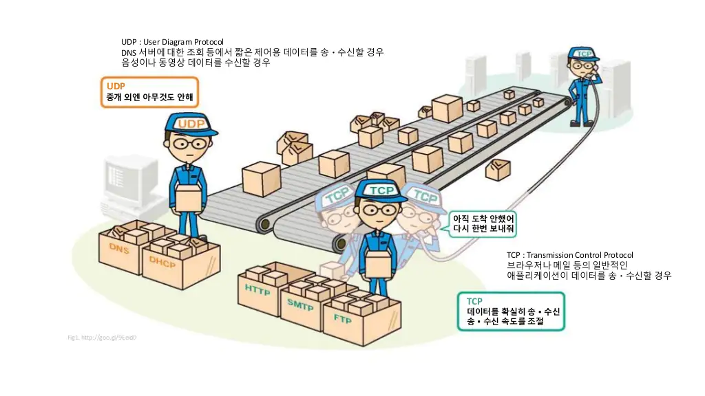
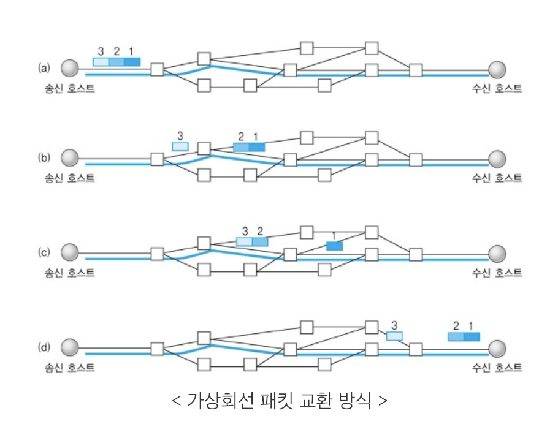

# TCP vs UDP

> 이전 글에서 TCP/IP를 왜 사용하며, 어떤 기능을 하는지, TCP/IP 4계층은 무엇인지 알아보았습니다.
> 이번 글에서는 TCP/IP 4계층 중 전송계층에서 사용되는 프로토콜인 UDP가 무엇인지, TCP와는 어떤 차이가 있는지 알아보겠습니다.

## UDP란?

> 사용자 데이터그램 프로토콜(User Datagram Protocol)

### UDP 특징

#### 하얀 도화지와 같다(= 기능이 거의 없다)

- 연결지향(TCP의 3 way handshake 와 같은 기능) 없음
- 데이터 전달 보증 기능 없음
- 패킷 순서 보장 기능 없음

=> 그럼 이걸 왜 쓰지...?

#### 단순하다 = 내맘대로 최적화 가능!

- TCP는 연결 확인도 하고, 데이터 전달 보증도 하고, 패킷 순서도 확인하고 할게 많다.
  - 레이턴시가 생길 수 밖에 없다!
  - 데이터 양도 많고, 이미 구축된 것들이 많아 더 이상의 최적화가 어렵다.
- UDP는 원하는 기능을 최적화해서 적용할 수 있다.
  - 최근 HTTP/3에서 UDP를 사용하여 3 way handshake를 최적화한 사례가 있다.

- 정리
  - IP와 거의 같다. + PORT & [체크섬](https://galid1.tistory.com/310) 정도만 추가
  - 나머지 설정은 애플리케이션에서 추가 작업이 필요

|          최적화를 별도로 하지 않은 UDP 중개 only..           |
| :----------------------------------------------------------: |
|  |

## TCP vs UDP

### 신뢰성 & 전송 속도

앞서 UDP에 대해 알아본 내용들을 가지고 TCP와 비교하면 다음과 같이 정리할 수 있습니다. TCP는 높은 신뢰성이, UDP는 빠른 전송속도가 장점입니다.

|          | TCP  | UDP  |
| :------- | :--: | :--: |
| 신뢰성   | 높음 | 낮음 |
| 전송속도 | 느림 | 빠름 |

### 데이터 교환 방식의 차이

TCP와 UDP는 데이텨 교환 방식에서도 차이를 보입니다. 각각 어떤 방식으로 데이터를 교환하는지 알아보고 표로 정리해보겠습니다.

#### TCP - 가상회선 패킷 교환 방식

>  가상회선: 3 way handshake를 통해 논리적으로 설정된 연결(연결지향)

1. 송신측과 수신측이 연결되면서 가상회선이 설정됨(= 패킷이 보내질 경로가 하나로 결정됨)
2. 각 패킷에는 가상회선 식별 번호(VCI) 포함
3. 모든 패킷을 전송하면 가상회선이 해제
4. 패킷들은 전송된 순서대로 도착

|                   가상 회선 패킷 교환 방식                   |
| :----------------------------------------------------------: |
|  |

#### UDP - 데이터그램 패킷 교환 방식

> 데이터그램
>
> - 데이터를 전송하기 전에 논리적 연결 X(비연결지향)
>
> - 각 패킷이 독립적으로 전송

1. 패킷을 수신한 라우터는 최적의 경로를 선택하여 패킷을 전송
   1. 하나의 메시지에서 분할된 여러 패킷은 서로 다른 경로로 전송 될 수 있음
2. 송신측에서 전송한 순서와 수신측에 도착한 순서가 다를 수 있음

|                  데이터그램 패킷 교환 방식                   |
| :----------------------------------------------------------: |
|  |

#### 정리

|                |      TCP       |       UDP       |
| :------------- | :------------: | :-------------: |
| 신뢰성         |      높음      |      낮음       |
| 전송속도       |      느림      |      빠름       |
| 연결 방식      |     연결형     |    비연결형     |
| 패킷 교환      | 가상 회선 방식 | 데이터그램 방식 |
| 전송 순서 보장 |     보장함     |  보장하지 않음  |