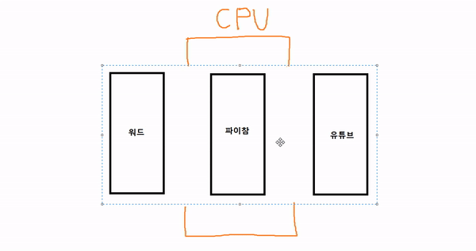

# Multi Process & Thread

---

## 1. Multi  Task (멀티 태스크)

> ### 1. Task? Process?
>
> 프로세스란 실행중에 있는 프로그램을 의미한다. 프로그램을 실행하면 해당 프로그램을 실행하기 위해서 메모리를 할당한다. **메모리가 할당되어 주 메모리에 적재된 것을 프로세스**라고 한다. 프로세스는 CPU에 의해서 처리된다.
>
> ``Task``란 ``Process``보다 좀 더 확장된 개념으로 보기도 한다. 하나의 운영체제에서 여러 개의 프로그램이 동작될 수 있는데 이 동작되는 각각의 프로그램을 ``Task``라고 볼 수 있다. 즉, CPU가 해야하는 일을 ``Task``라고 한다. 처리해야할 ``Process``도 ``Task``에 포함될 수 있고, 처리해야할 ``Thread``도 포함될 수 있다.
>
> 이 문서에서는 이해를 쉽게 하기 위해서 컴퓨터가 처리해야 할 일인 ``Task``와 ``Process``를 동일하게 취급한다.
>
> ### 2. 멀티 태스킹
>
> 
>
> - 프로세서 안에서 OS의 스케줄링 방식에 따라 ``Process``가 번갈아 수행되는 것

 

## 2. Multi  Process(멀티 프로세스)

- 멀티 프로세스란 CPU 내의 여러 개의 코어(프로세서)가 하나 이상의 Process를 동시에 병렬 처리하는 것을 의미한다.

- 각 프로세스는 독립된 메모리 영역을 할당받고, 별도의 주소 공간에서 실행된다.

- 프로세스 간 변수, 자료구조에 접근할 수 없기 때문에 프로세스 간 통신(IPC, inter-process communication)을 사용해야 한다.

  > ※ 자원 : 주변 장치, 대용량 저장장치, 전원 공급 장치 등

 

## 3. Multi  Thread (멀티 스래드)

- 멀티 스레드란 하나의 프로세스 내에서 둘 이상의 스레드가 동시에 작업을 수행하는 것을  의미한다.
- 프로세스 내의 주소 공간이나 자원들을 스레드 끼리 공유하며 실행된다.
- 한 스레드가 공유하는 자원을 변경하면 다른 스레드에도 적용된다.

 

## 4. 멀티 프로세스 vs 멀티 스레드

> ### 장단점
>
> - 멀티 프로세스
>   - 처리 중인 여러개의 프로세스 중 일부에 문제가 생겨도 전체 프로세스 수행에 영향을 미치지 않는다.  --> **각각의 프로세스가 독립적으로 메모리를 할당받고 독립적으로 수행되기 때문**
>   - Context Switching과정에서 캐쉬 메모리 초기화 등의 수행하기 무거운 작업이 진행되고 시간이 많이 소모되는 등의 오버헤드가 발생 --> **독립된 영역에서 수행 중이기 때문에 Context Switching이 발생하면 캐쉬 메모리를 리셋하고 필요한 데이터를 다시 불러와야 하기 때문**
> - 멀티 스레드
>   - 소모되는 자원이 감소하고, 시스템 처리량이 증가한다.  하나의 스레드에 문제가 발생하면 전체 프로세스가 영향을 받는다. --> **Stack 영역을 제외한 자원을 공유하고 있기 때문에 자원 점유량이 감소하고, 데이터 통신이 간단기 때문**
>   - 자원을 공유하기 때문에 동기화에 문제가 발생한다.
>   - 서로 다른 프로세스의 스레드를 제어할 수 없다.

