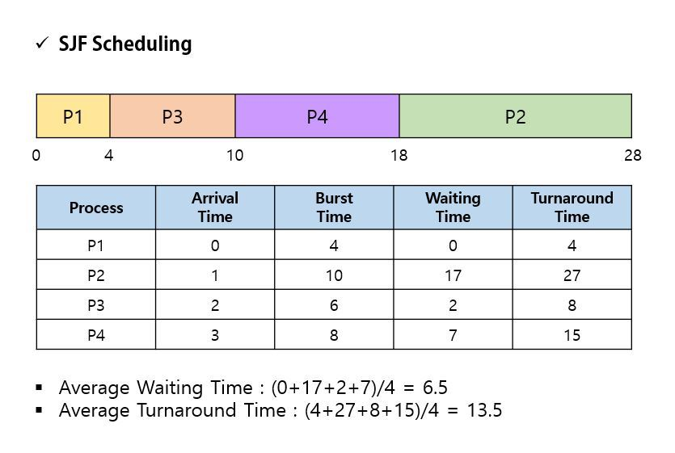
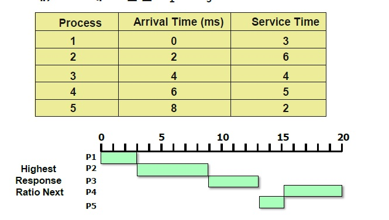
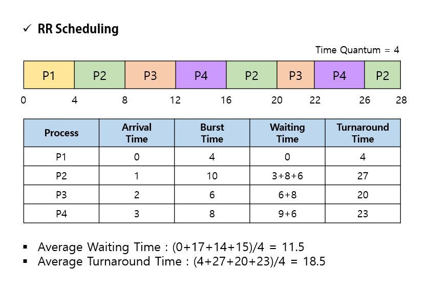
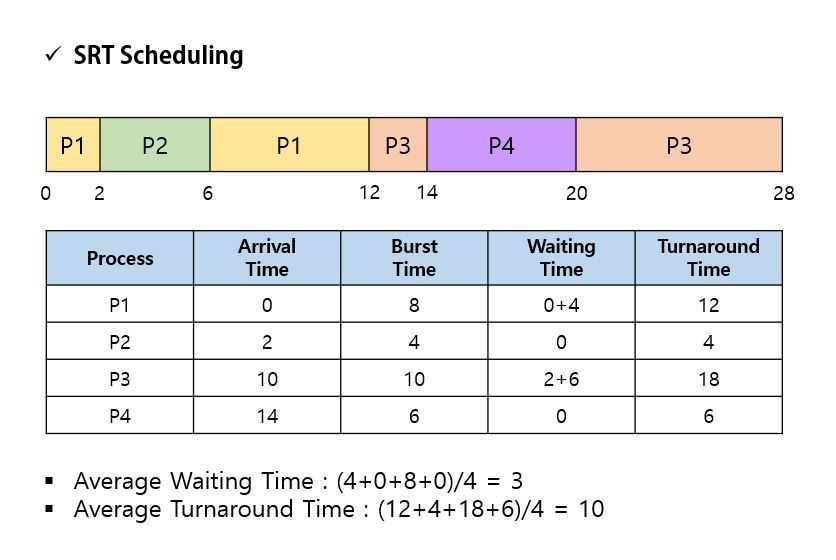
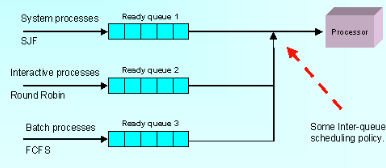
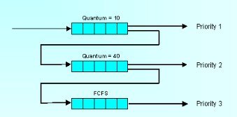

# CPU Scheduling

---

## 1. 비선점 vs 선점 스케줄링

> ### 스케줄링이 일어나는 시점
>
> 
>
> - 프로세스가 실행 상태에서 대기 상태로 전환될 때
> - 프로세스가 실행 상태에서 준비완료 상태로 전환될 때
> - 프로세스가 대기 상태에서 준비완료 상태로 전환될 때
> - 프로세스가 종료될 때
>
> 1, 4번의 경우 비선점 스케줄링이 일어나고, 2, 3번의 경우 선점 스케줄링이 일어난다.

## 2. 비선점 스케줄링

- 한 프로세스가 CPU를 할당받으면 해당 프로세스 종료 후 반환까지 다른 프로세스가 CPU 점유가 불가능한 방식
- 모든 프로세스를 공정하게 처리할 수 있지만, 비효율적일 수 있다.
- 처리 시간 편차가 적은 특정 환경에 용이

> ### FCFS(Fisrt-Come Fisrt-Service)
>
> 
>
> - FIFO(First In First Out)과 동일한 의미.
> - 먼저 준비상태에 큐에 도착한 프로세스가 먼저 CPU에 의해 처리
> - 시간이 적게 걸리는 작업이 오랜 시간을 기다리는 경우가 발생
>
>  
>
> ### SJF(Shortest Job Fisrt)
>
> 
>
> - 작업 시간이 적은 순서대로 처리
> - 가장 적은 평균 대기시간을 가진다.
> - 실행 시간이 긴 프로세스가 무한 대기 상태에 빠질 수 있다. -> 기아 현상(Starvation)
>   - 기아 현상 : 시스템 부하가 많아서 낮은 등급에 있는 준비 큐의 프로세스가 무한정 기다리는 현상
>   - 기아현상을 해결하기 위해서 대기 시간이 긴 프로세스의 우선순위를 높여주는 에이징(Aging) 기법 활용
>
>  
>
> **HRN (Highest Response Ratio Next)**
>
> 
>
> - 대기 중인 프로세스 중 현재 Response Ratio가 가장 높은 것을 선택
>   - Response Ratio = (대기시간 + 서비스 시간) / 서비스 시간
> - SFJ의 기아 현상을 보완한 기법
> - 작업 시간이 긴 프로세스와 짧은 프로세스 간의 불평등을 완화

## 3. 선점 스케줄링

- 하나의 프로세스가 CPU를 점유하고 있더라도, 우선순위가 높은 다른 프로세스가 현재 프로세스를 중단시키고 CPU를 점유하는 방식
- 비교적 응답이 빠르지만, 처리 시간 예측이 어렵고 우선순위가 높은 프로세스가 계속 들어오면 오버헤드가 발생
- 우선 순위가 높은 프로세스를 빠르게 처리해야 할 경우에 유용

> **RR (Round Robin / RR)**
>
> 
>
> - 프로세스마다 같은 크기의 CPU 시간을 할당
> - 할당된 시간 내에 처리되지 못하면 준비 큐의 가장 뒤로 보내지고, 다음 대기 중인 프로세스가 CPU를 점유
> - 균등한 CPU 점유 시간을 보장하며, 시분할 시스템을 이용
>
>  
>
> **SRT(Shortest Remaining Time First)**
>
> 
>
> - 가장 짧은 시간이 소요되는 프로세스를 먼저 수행
> - 남은 시간이 더 짧은 프로세스가 준비 큐에 대기 중이면 언제든지 프로세스가 선점됨.
>
>  
>
> **다단계 큐(Multi Level Queue)**
>
> 
>
> - 여러 가지 작업 큐를 이용해서 스케줄링.
> - 상위 단계 작업이 먼저 선점
> - 각 큐는 자신만의 독자적인 스케줄링을 가짐
>
>  
>
> **다단계 피드백 큐(Multi Level Feedback Queue)**
>
> 
>
> - 입출력 위주와 CPU 위주인 프로세스의 특성에 따라 큐마다 서로 다른 CPU 시간 할당량을 부여
> - 비선점 스케줄링인 FCFS와 선점 스케줄링인 RR의 기법을 혼합
> - 새로운 프로세스는 우선순위가 높지만 프로세스 실행 시간이 길어질 수록 점점 낮은 우선순위의 큐로 이동
> - 마지막 단게에서 FCFS 방식을 적용

