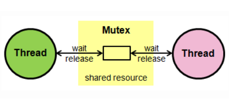
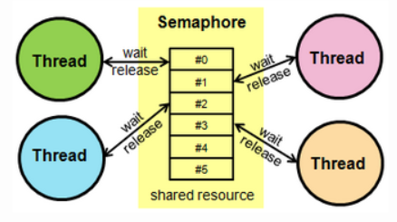

# 동기화(Synchronization)

---

## 동기화란?

> 운영체제는 다중 프로그래밍 시스템이기 때문에 여러 개의 프로세스가 존재하고 병행되고 있다. 병행 수행 중인 프로세스들이 공유 자원에 동시에 접근하게 된다면 문제가 발생할 수 있다. 따라서 **동기화**라는 것을 통해 프로세스 간 동작을 맞추소 정보를 공유해야 한다.

 

## 동기화 용어 정리

> ### Independent process
>
> - 프로세스 간 서로 영향을 미치지 않는 독립적인 프로세스
>
> ### Cooperating process
>
> - 프로세스 간 서로 영향을 미치는 프로세스
>
> ### 임계 구역(Critical section)
>
> - 공유 자원에 접근할 때, 하나의 프로세스만 접근할 수 있도록 제한해둔 영역
>
> ### 경쟁 조건(Race condition)
>
> - 프로세스가 공유 자원에 접근할 때, 접근 순서에 따라서 실행 결과가 달라질 수 있는 상황

 

## 임계구역(Critical section)

> 공유 자원에 접근할 때, 한 번에 하나의 프로세스만 접근할 수 있도록 제한하는 것.
>
>  
>
> ### 임계 구역을 위한 세 가지
>
> - 상호 배제 : 둘 이상의 프로세스가 임계 영역에 동시 진입 불가
>
>   (Mutual exclusion)
>
> - 진행 : 임계 영역에 프로세스 자리가 비었다면 언제든지 진입 가능해야 함
>
>   (Progress)
>
> - 유한 대기 : 언젠가(유한 시간에)는 임계 영역에 프로세스가 진입 가능해야 함
>
>   (Bounded waiting)

 

## 경쟁 상황(Race Condition)

> 공유된 자원, 즉 임계 구역을 동시에 여러 프로세스가 접근하려 할 때 문제가 발생할 수 있는 상황을 의미한다. 임계 구역을 보호하기 위해서 상호 배제라는 것을 이용하는데 이 때문에 발생할 수 있는 문제점이 있다.
>
> ### 경쟁 상황 속에서 발생할 수 있는 문제점 
>
> - 교착 상태(Deadlock)
>
>   두 프로세스가 실행되기 위해서 자원을 필요로 할 때, 서로 자원을 점유하고 리소스를 해제하지 않아서 교착상태에 빠져버리는 것 
>
> - 기아 상태(Starvation)
>
>   프로세스들이 더 이상 진행을 하지 못하고 영구적으로 블록되어 있는 상태로, 두 개 이상의 작업이 서로 상대방의 작업이 끝나기만을 기다리고 있기 때문에 결과적으로는 아무것도 완료되지 못하는 상태.

 

## 뮤텍스와 세마포어

> ### 뮤텍스(Mutex)
>
> 
>
> - Locking을 이용하여 상포배제를 수행하는 방법
> - 공유 자원을 점유할 수 있는 프로세스( 혹은 스레드 )가 단 하나
> - 뮤텍스 값은 0 또는 1만 가질 수 있다.
> - 뮤텍스는 자원을 소유하고 있는 스레드만이 자원을 해제할 수 있다.
>
> ### 세마포어(Semaphore)
>
> 
>
> - 공유 자원을 점유할 수 있는 프로세스( 혹은 스레드 )가 허용된 만큼 존재
> - 세마포어는 이진수를 사용하거나 추가적인 값을 가질 수 있다.
> - 세마포어는 자원을 가지고 있지 않은 다른 스레드가 자원을 해제할 수 있다.
>
> [뮤텍스와 세마포어 차이점 참고 설명](https://worthpreading.tistory.com/90)

 

## 동기화 관련 문제

> [고전적인 동기화 문제 참고 설명](https://yoongrammer.tistory.com/64)

