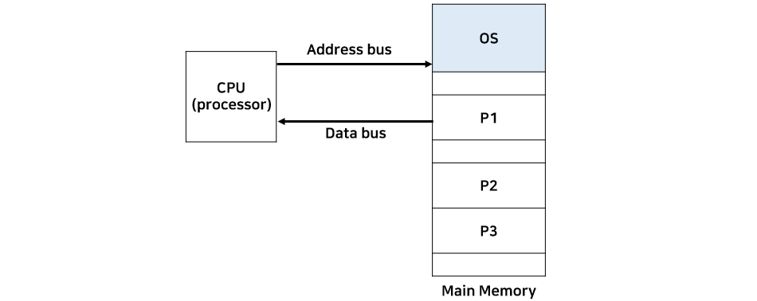
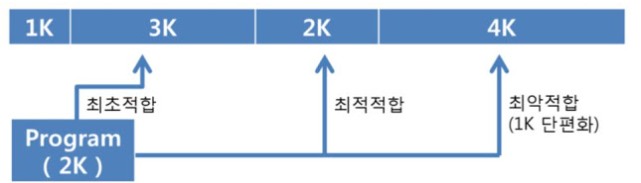
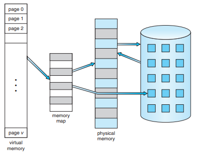
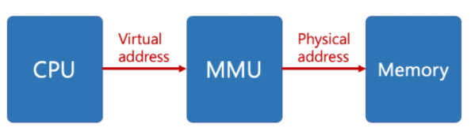
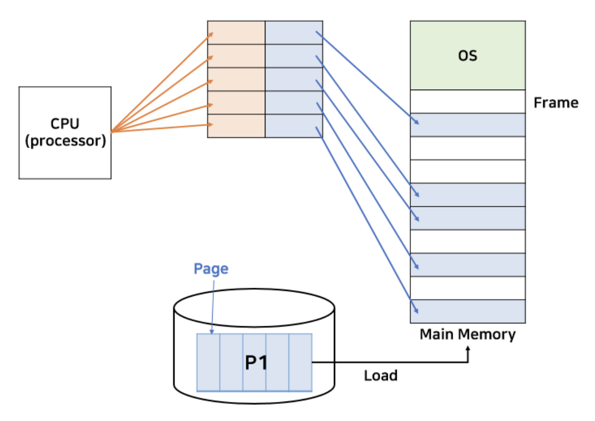
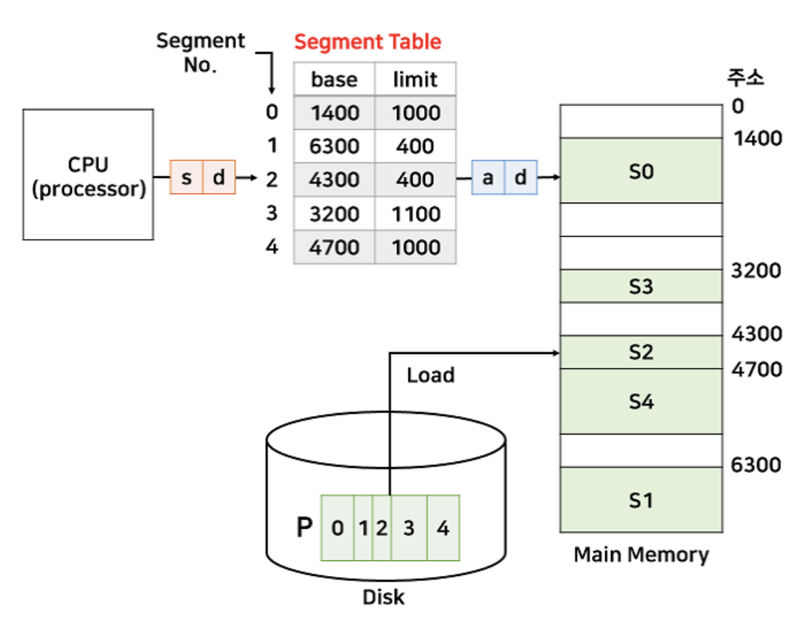

# 메모리

---

## 메모리

> ### 메모리란?
>
> 
>
> - 주기억장치(RAM) <-> 보조기억장치
> - CPU가 직접 접근할 수 있는 메모리
> - 프로그램이 실행되려면 프로그램이 복사되어 메모리로 적재되어야함 -> 프로세스
> - CPU는 연산을 수행한 뒤에 메인 메모리에 데이터를 저장하거나 필요한 데이터를 요구함

 

## 단편화

> 프로세스들이 주메모리에 적재되고, 주메모리에서 제거되는 일이 반복되면 점점 메모리 공간이 나누어진다. 전체적으로 보면 충분히 사용할 수 있을만큼 메모리가 남아있지만, 잘게 쪼게져서 할당이 불가능한 상태를 메모리가 단편화된 상태라고 한다.
>
> ### 내부 단편화
>
> 
>
> - 할당된 메모리의 크기가 프로세스의 크기보다 커서 발생하는 현상
>
>  
>
> ### 외부 단편화
>
> 
>
> - 분할된 메모리의 크기가 프로세스보다 작아 메모리에 적재될 수 없는 현상

## 메모리 관리 전략

> ### 반입(Fetch)전략
>
> - 디스크에 저장된 프로그램을 **언제(When)** 메모리로 적재할 것인지 결정하는 전략
>
> | 방법      | 설명                                                         |
> | --------- | ------------------------------------------------------------ |
> | 요구 반입 | - 프로그램이 필요로하는 데이터를 요구할 때 적재하는 방법   - 메모리에 데이터를 올려야할 때, 요청을 하면 운영체제가 해당 데이터를 올려주는 방식 |
> | 예상 반입 | 프로그램이 필요로 하는 데이터를 미리 예상하여 적재하는 방법  |
>
>  
>
> ### 배치(Placement)전략
>
> 
>
> - 데이터를 적재할 때 **어디에(Where)** 적재할지 결정하는 방법
>
> | 방법                 | 설명                                               |
> | -------------------- | -------------------------------------------------- |
> | 최초 적합(First Fit) | 적재 가능한 공간 중에서 첫번째 공간에 배치         |
> | 최적 적합(Best Fit)  | 적재 가능한 공간 중 단편화가 가장 적은 공간에 배치 |
> | 최악 적합(Worst Fit) | 적재 가능한 공간 중 가장 큰 공간에 배치            |
>
>  
>
> ### 교체 전략
>
> - 주 메모리가 모두 사용중일 때, 메모리가 꼭 필요한 경우 적재되어 있는 어떤 프로세스와 교체할지 결정하는 방법

 

## 가상메모리

> ### 가상메모리란?
>
> 
>
> - 메모리가 실제 메모리보다 많아 보이게 하는 기술
> - 프로세스가 실행될 때, 실제로 프로세스의 모든 부분이 필요한 것은 아님.
> - 필요한 부분만 실제 메모리에 적재하는 기술
>
> ### MMU( Memory Management Unit)
>
> 
>
> - 가상 주소를 실제 메모리 주소로 변환해주는 하드웨어 장치
> - CPU는 가상 메모리의 가상 주소(논리적 주소)로 접근
> - MMU는 이 가상메모리를 실제 메모리의 물리적 주소로 변환해주는 역할을 함.
> - CPU에서 프로세스를 처리하기 위해 필요한 데이터가 저장된 가상 메모리로 접근하면, 해당 부분을 MMU가 물리적 주소로 변환하여 메모리에 적재.
> - 메모리에 적재된 데이터를 CPU가 사용하여 연산을 진행

 

## 가상 메모리의 메모리 관리 전략

> ### 페이징 기법
>
> 
>
> - 가상 메모리에 적재된 부분과 메모리를 동일한 크기로 나누는 것.
>   - 가상 메모리에 적재된 프로세스는 페이지 단위로 나뉘고, 물리 메모리는 프레임 단위로 나눠진다.
> - CPU는 가상 메모리의 특정 페이지를 요청하고 MMU가 해당 데이터들을 물리 메모리에 적재
> - CPU는 MMU가 알려준 물리 메모리의 데이터 위치를 참조하여 연산
> - 만약에 페이지의 크기가 프레임의 크기가 페이지보다 살짝 크다면 내부 단편화가 발생한다.
>
>  
>
> ### 세그멘테이션
>
> 
>
> - 프로세스를 논리적으로 나누는 것.
>   - 페이징은 같은 크기로 분할하지만 세그멘테이션은 각기 다른 크기로 나눔
>   - 가상 메모리에 적재된 프로세스는 세그먼트라고 한다.
> - CPU는 마찬가지로 물리 메모리의 데이터 위치를 참조하여 연산
> - CPU가 필요한 데이터의 세그먼트가 현재 남아있는 메모리의 빈 공간에 들어갈 수 없을 경우 인터럽트가 발생한다.

