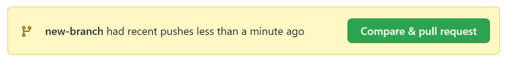
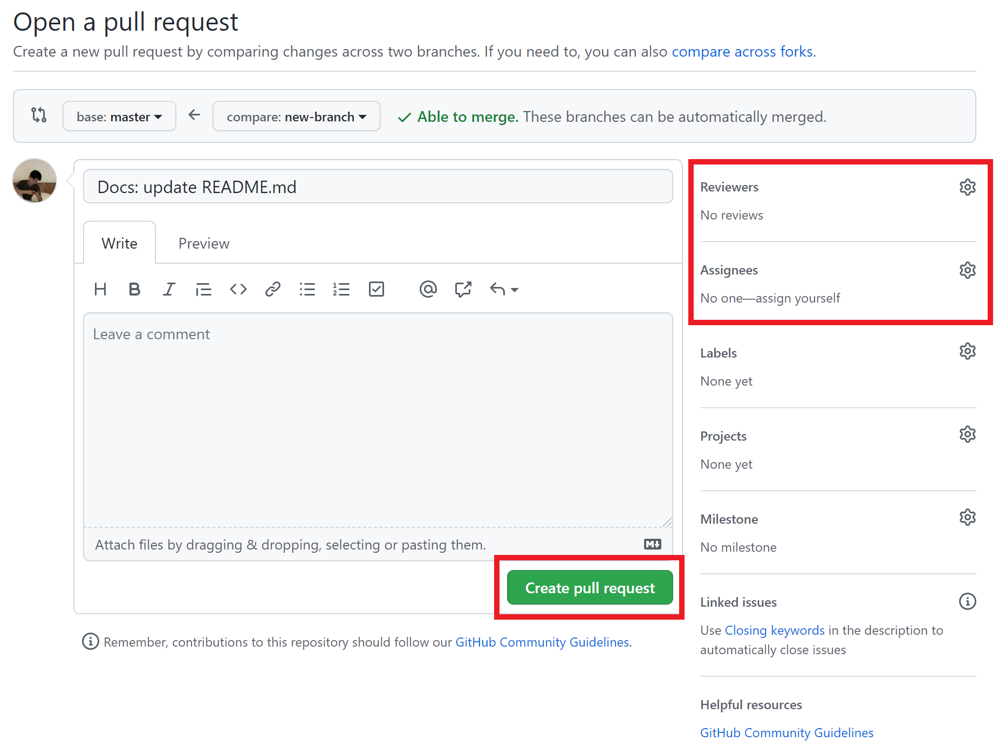

# CS-Study


<details>
<summary>PR 생성 방법</summary>
<div markdown="1">

  #### Branch 확인, 생성, 이동, 삭제

  ##### 1. Branch 확인하기

  - 현재 내가 위치한 브랜치 확인

  ```bash
  $ git branch
  ```

  - 원격 저장소의 브랜치 확인

  ```bash
  $ git branch -r
  ```

  ##### 2. Branch 생성 및 이동

  - 브랜치를 생성함과 동시에 이동하기

  ```bash
  $ git switch -c new-branch
  # 새로 만든 'new-branch'로 이동합니다.
  ```

  - 브랜치 이동하기

  ```bash
  $ git switch old-branch
  # 'old-branch'로 전환합니다.
  ```

  ##### 3. Branch 삭제

  ```bash
  $ git branch -d new-branch
  # 'new-branch'를 삭제합니다.
  ```

  <br>

  #### 생성한 Branch에서 원격 Repository에 push하기

  ##### 1. 생성한 Branch로 이동

  ```bash
  $ git switch new-branch
  ```

  ##### 2. add, commit, push

  ```bash
  # add
  $ git add .

  # commit
  $ git commit -m 'commit-message'

  # push
  # 현재 위치한 브랜치에 push!(아래 예시는 new-branch에 push)
  $ git push origin new-branch
  ```

  ##### [참고] Commit convention rule

  > push 하는 날짜-[주제]-내용-상태

  `ex) 2019-10-14 [Network] Sort Add/Update/Delete`

  <br>

  ##### 3. github repository에서 pull request 생성

  - push 후 git repository로 가면 아래와 같은 버튼이 생성됩니다.

  

  - Reviewers, Assignees를 선택하고 Create pull request를 보냅니다.
  - Reviewer, Assignee를 선택할 때, 기능적인 차이는 없습니다. 일반적으로 다음과 같은 의미 차이만 있습니다.
  - Reviewer: 코드를 리뷰해줄 사람
  - Assignee: 프로젝트 책임자, merge 권한이 있는 사람

  

</div>
</details>